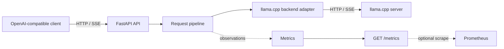

# llm-production-platform

`llm-production-platform` is a production-oriented educational project that
demonstrates how an LLM serving API can be designed around FastAPI and a
CPU-hosted [llama.cpp](https://github.com/ggerganov/llama.cpp) server.

The project focuses on the systems surrounding inference: API compatibility,
streaming, admission control, queueing, observability, deployment, and
repeatable performance measurement. It is deliberately small enough to study
and modify. It is not intended to compete with inference engines such as vLLM
or SGLang.

Phase 3 is implemented: the repository contains a locally runnable FastAPI
service with health checks, model discovery, and buffered or SSE-streaming chat
completions forwarded to a separately running llama.cpp server, plus
Prometheus-compatible production metrics. Later capabilities remain on the
phased development plan.

## Goals

- Expose a documented subset of the OpenAI REST API.
- Proxy inference to a separately running llama.cpp server.
- Stream responses without buffering the complete model output.
- Bound resource use with an explicit request queue and concurrency limit.
- Publish application and inference metrics for Prometheus.
- Provide a useful Grafana dashboard and a Docker Compose deployment.
- Make benchmarks reproducible on a CPU-only development machine.
- Keep API, orchestration, backend, telemetry, and deployment concerns separate.
- Provide stable extension points for authentication, rate limiting, multiple
  models, Kubernetes, and distributed operation.

## Non-goals

- Reimplementing model inference, tokenization, or continuous batching.
- Matching every OpenAI API endpoint or parameter in the first release.
- Outperforming specialized distributed serving engines.
- Treating in-process queueing as a distributed scheduler.
- Providing high availability or multi-node coordination in the initial
  deployment.
- Claiming benchmark results that generalize beyond the recorded hardware,
  model, quantization, and configuration.

## Initial API scope

The first compatibility target is:

- `GET /health/live`
- `GET /health/ready`
- `GET /v1/models`
- `POST /v1/chat/completions`, with both buffered and Server-Sent Events (SSE)
  responses
- `GET /metrics`

The currently implemented Phase 3 subset is:

- `GET /health` and `GET /health/live` for process-local liveness;
- `GET /ready` and `GET /health/ready` for a live llama-server probe;
- `GET /v1/models` for the configured public model;
- `POST /v1/chat/completions` for buffered and SSE-streaming requests; and
- `GET /metrics` for bounded-cardinality Prometheus exposition.

OpenAI compatibility is a versioned, tested contract rather than a claim that
all OpenAI behavior is supported. Unsupported fields and endpoints will be
documented, and compatibility fixtures will cover response envelopes, error
objects, and streaming termination.

## System at a glance



FastAPI owns the public protocol. The service layer owns request orchestration,
cancellation, timing, and terminal outcomes. A backend adapter translates the
internal request model to llama.cpp's API. Metrics observe these boundaries
without controlling them. Queueing and concurrency policy remain planned
later-phase service responsibilities.

See [Architecture](docs/architecture.md) for component boundaries and the
complete request lifecycle.

## Planned repository layout

The layout below is a design target, not yet implemented:

```text
.
├── src/llm_platform/
│   ├── api/             # HTTP routes, schemas, error and SSE presentation
│   ├── application/     # use cases and request orchestration
│   ├── domain/          # internal models, policies, and ports
│   ├── backends/        # llama.cpp adapter and backend transport
│   ├── scheduling/      # queue and concurrency implementations
│   ├── observability/   # metrics, logging, and request context
│   └── config/          # typed settings and composition root
├── tests/
│   ├── unit/
│   ├── integration/
│   ├── contract/
│   └── load/
├── benchmarks/          # scenarios, runner configuration, and result schema
├── deploy/
│   ├── docker/
│   ├── prometheus/
│   └── grafana/
├── docs/
└── compose.yaml
```

Dependencies point inward: protocol and infrastructure code depend on
application/domain interfaces, not the reverse. Framework objects, llama.cpp
payloads, and Prometheus collectors do not leak into core orchestration.

## Delivery strategy

Implementation is divided into small vertical phases. Every phase ends with a
runnable system and automated acceptance checks; later phases add capability
without invalidating earlier behavior:

1. Walking skeleton and health endpoints
2. Non-streaming chat completion
3. End-to-end streaming
4. Production observability
5. Bounded queue and concurrency control
6. Production error handling and lifecycle management
7. Prometheus, Grafana, and Docker Compose
8. Reproducible benchmarks and documentation hardening

The detailed entry criteria, deliverables, tests, and exit criteria are in the
[Development plan](docs/development-plan.md).

## Design principles

- **Bound every resource.** Queue size, active requests, timeouts, response
  sizes where practical, and metric label sets have explicit limits.
- **Propagate cancellation.** Client disconnects and shutdown signals cancel
  queued or active work and release capacity promptly.
- **Preserve backpressure.** Streaming data is forwarded incrementally through
  bounded buffers; a slow client must not create unbounded memory growth.
- **Measure state transitions.** Queue delay, backend latency, stream duration,
  outcomes, and current queue/active counts are observable.
- **Keep policy replaceable.** In-memory FIFO scheduling is the initial policy,
  behind interfaces that can later be replaced by per-tenant or distributed
  admission control.
- **Prefer explicit compatibility.** Supported API behavior is documented and
  contract-tested.
- **Make deployment reproducible.** Image digests or versions, model identity,
  configuration, and benchmark metadata are recorded.

## Documentation

- [Architecture](docs/architecture.md): boundaries, request lifecycle, failure
  behavior, configuration, and extension points
- [Development plan](docs/development-plan.md): independently testable delivery
  phases
- [Metrics](docs/metrics.md): metric names, labels, lifecycle semantics, and
  cardinality policy
- [Contributor/agent guidance](AGENTS.md): rules for future implementation work

## Local run

Python 3.12 or newer is required. On Ubuntu 24.04/WSL2, create an isolated
environment and install the application plus development checks:

```bash
python3 -m venv .venv
source .venv/bin/activate
python -m pip install --upgrade pip
python -m pip install -e '.[dev]'
```

Runtime dependencies are deliberately small: FastAPI provides the ASGI/API
layer, Pydantic validates public and upstream boundaries, httpx provides the
shared asynchronous backend client, prometheus-client owns the isolated
metrics registry and exposition format, and Uvicorn runs the ASGI process. The
optional `dev` group adds only pytest/pytest-asyncio for tests, Ruff for
formatting/linting, and mypy for static type checking. Version ranges constrain
each dependency to its current major release.

Start a compatible `llama-server` separately. The exact binary path, model,
context, and CPU thread count are local choices; a typical invocation is:

```bash
./llama-server \
  --model ./models/your-model.gguf \
  --host 127.0.0.1 \
  --port 8080
```

The model file must be supplied locally and must not be committed. Verify that
the selected llama.cpp build exposes `/health` and the OpenAI-compatible
`/v1/chat/completions` endpoint.

Then start the API:

```bash
LLAMA_SERVER_BASE_URL=http://127.0.0.1:8080 \
LLAMA_SERVER_TIMEOUT_SECONDS=120 \
LLM_PLATFORM_MODEL=local-model \
uvicorn llm_platform.main:app --host 127.0.0.1 --port 8000
```

`LLAMA_SERVER_BASE_URL` defaults to `http://127.0.0.1:8080`,
`LLAMA_SERVER_TIMEOUT_SECONDS` defaults to 120 seconds,
`LLAMA_SERVER_STREAM_IDLE_TIMEOUT_SECONDS` defaults to 30 seconds,
`LLAMA_SERVER_STREAM_EVENT_MAX_BYTES` defaults to 1 MiB, and
`LLM_PLATFORM_MODEL` defaults to `local-model`. Settings are validated at
startup. The buffered timeout continues to cover backend HTTP operations; the
stream idle timeout applies independently between upstream reads. Generation
requests are never retried automatically.

Check the service and send a completion:

```bash
curl http://127.0.0.1:8000/health
curl http://127.0.0.1:8000/ready
curl http://127.0.0.1:8000/v1/chat/completions \
  -H 'content-type: application/json' \
  -d '{
    "model": "local-model",
    "messages": [{"role": "user", "content": "Say hello briefly."}],
    "stream": false
  }'
```

Run all checks:

```bash
ruff format --check .
ruff check .
mypy
pytest
```

### Phase 1 real-backend smoke test

Phase 1 was verified end to end on WSL2 Ubuntu with an AMD Ryzen 7 5800H in
CPU-only mode. The backend was the llama.cpp `llama-server` binary at
`/home/chen1/projects/llm-inference-optimization-lab/third_party/llama.cpp/build-release/bin/llama-server`,
serving the Q4_K_M quantization of Qwen2.5-0.5B-Instruct from
`/home/chen1/projects/llm-inference-optimization-lab/models/qwen2.5-0.5b-instruct-q4_k_m.gguf`.

The verified request path was:

```text
curl client -> FastAPI -> llama.cpp llama-server
            -> Qwen2.5-0.5B-Instruct GGUF
            -> OpenAI-compatible JSON response
```

With `llama-server` at `http://127.0.0.1:8080` and the platform at
`http://127.0.0.1:8000`, `GET /health`, `GET /ready`, `GET /v1/models`, and
`POST /v1/chat/completions` all returned HTTP 200. The chat response retained
the backend's `id`, `object`, `model`, `choices`, `usage`,
`system_fingerprint`, and `timings` fields.

Reproduce the smoke test from the repository root in separate terminals:

```bash
/home/chen1/projects/llm-inference-optimization-lab/third_party/llama.cpp/build-release/bin/llama-server \
  --model /home/chen1/projects/llm-inference-optimization-lab/models/qwen2.5-0.5b-instruct-q4_k_m.gguf \
  --host 127.0.0.1 \
  --port 8080
```

```bash
LLAMA_SERVER_BASE_URL=http://127.0.0.1:8080 \
LLAMA_SERVER_TIMEOUT_SECONDS=120 \
LLM_PLATFORM_MODEL=local-model \
uvicorn llm_platform.main:app --host 127.0.0.1 --port 8000
```

```bash
curl --fail http://127.0.0.1:8000/health
curl --fail http://127.0.0.1:8000/ready
curl --fail http://127.0.0.1:8000/v1/models
curl --fail http://127.0.0.1:8000/v1/chat/completions \
  -H 'content-type: application/json' \
  -d '{
    "model": "local-model",
    "messages": [{"role": "user", "content": "Say hello briefly."}],
    "stream": false
  }'
```

This smoke test checks platform integration and response handling; the answer
quality of this small model is not a platform correctness signal.

### Supported chat completion fields

| Field | Phase 2 behavior |
|---|---|
| `model` | Required and forwarded |
| `messages` | Required; `system`, `user`, and `assistant` text messages |
| `temperature` | Optional and forwarded |
| `max_tokens` | Optional and forwarded |
| `stream` | Optional; `false` returns JSON and `true` returns SSE |
| Any other field | Rejected rather than silently ignored |

Successful responses are validated as OpenAI-shaped JSON and retain
llama.cpp extension fields. Safe, structured upstream 4xx details are retained;
upstream 5xx, invalid JSON/shape, timeouts, and connection failures are mapped
to stable gateway errors without exposing Python exception details or raw
backend bodies.

Phase 2 intentionally has no request queue, concurrency limit, authentication,
rate limiting, Prometheus/Grafana, Docker, or Kubernetes.

## Phase 2 Streaming

### Architecture

Streaming follows the existing ports-and-adapters boundaries:

```text
FastAPI route -> CompletionService -> InferenceBackend port
              -> LlamaCppBackend -> llama-server SSE
```

The llama.cpp adapter owns the upstream HTTP response and incrementally parses
bounded SSE events into backend-neutral chunks. The completion service owns
stream timing and terminal logging. The API layer serializes those chunks into
OpenAI-compatible SSE frames. Each layer awaits the next layer directly, so a
slow client applies backpressure without an unbounded queue or a background
producer task. Closing or cancelling the downstream iterator closes the
upstream response.

TTFT is measured from the start of the backend stream operation to the first
chunk containing non-empty assistant content. Every stream writes one terminal
structured log record containing `request_id`, `ttft_seconds` (or `null` when
no content arrived), `stream_duration_seconds`, and `outcome`.

### Supported API

`POST /v1/chat/completions` accepts the same supported fields for buffered and
streaming calls. With `"stream": true`, a successful response has
`Content-Type: text/event-stream`, emits each OpenAI
`chat.completion.chunk` as `data: {json}`, and terminates exactly once with:

```text
data: [DONE]

```

The response is not accumulated before delivery. Unicode and events split
across HTTP transport reads are supported. A malformed, truncated, timed-out,
or disconnected upstream stream emits a stable OpenAI-shaped SSE error frame
after headers have been sent, closes the response, and never emits `[DONE]`.
Backend HTTP or transport failures detected before streaming headers use the
normal OpenAI-shaped JSON error response.

### Streaming example

A successful response has this shape:

```text
data: {"id":"chatcmpl-1","object":"chat.completion.chunk","created":1700000000,"model":"local-model","choices":[{"index":0,"delta":{"role":"assistant"},"finish_reason":null}]}

data: {"id":"chatcmpl-1","object":"chat.completion.chunk","created":1700000000,"model":"local-model","choices":[{"index":0,"delta":{"content":"Hello"},"finish_reason":null}]}

data: [DONE]

```

Use `curl --no-buffer` to display events as they arrive:

```bash
curl --no-buffer http://127.0.0.1:8000/v1/chat/completions \
  -H 'content-type: application/json' \
  -d '{
    "model": "local-model",
    "messages": [{"role": "user", "content": "Count to three briefly."}],
    "stream": true
  }'
```

### Limitations

- Compatibility covers only the request fields listed above and OpenAI-style
  chat completion chunks; unsupported fields are rejected.
- There are no heartbeat events or automatic generation retries.
- The stream idle timeout is per upstream read, not a total generation
  deadline. The total stream duration can therefore exceed it while chunks
  continue to arrive.
- SSE events larger than `LLAMA_SERVER_STREAM_EVENT_MAX_BYTES` are rejected to
  keep parser memory bounded.
- Queueing, concurrency limits, authentication, rate limiting, dashboards,
  containers, and orchestration remain later phases.

## Phase 3 Observability

### Metrics architecture

Each FastAPI application instance creates one private Prometheus
`CollectorRegistry` during composition and exposes it through `GET /metrics`.
The application completion service reports backend-neutral lifecycle events
through a small metrics port; only the adapter under `observability` imports
prometheus-client. This keeps Prometheus collectors out of the domain and
backend adapters and makes every test application independent of
process-global collector state.

The completion service is the terminal lifecycle owner. It balances gauges in
cleanup paths, records one terminal chat outcome, and uses the same bounded
outcome vocabulary as structured stream logs. Metrics are passive
observations: collector failures are logged and do not replace an inference
result.

### Using `/metrics`

```bash
curl --fail http://127.0.0.1:8000/metrics
```

A minimal Prometheus configuration for a Prometheus process running on the same
host is:

```yaml
global:
  scrape_interval: 15s
  scrape_timeout: 10s

scrape_configs:
  - job_name: llm-platform
    static_configs:
      - targets: ["127.0.0.1:8000"]
```

The metrics endpoint does not count its own scrapes. No Prometheus server or
deployment files are included in this phase.

### Key metrics

| Metric | Type | Meaning |
|---|---|---|
| `llm_platform_http_requests_total` | Counter | Completed HTTP traffic by normalized endpoint, method, and status class |
| `llm_platform_chat_requests_total` | Counter | Exactly one terminal outcome per validated buffered or streaming chat request |
| `llm_platform_generated_tokens_total` | Counter | Trusted backend-reported completion tokens |
| `llm_platform_upstream_errors_total` | Counter | Upstream failures using a bounded error taxonomy |
| `llm_platform_client_disconnects_total` | Counter | Completion lifecycles cancelled by client disconnect |
| `llm_platform_request_duration_seconds` | Histogram | Validated request start through terminal cleanup |
| `llm_platform_time_to_first_token_seconds` | Histogram | Backend start to first non-empty content chunk |
| `llm_platform_upstream_duration_seconds` | Histogram | Backend start through upstream termination and cleanup |
| `llm_platform_active_requests` | Gauge | Currently active completion lifecycles by mode |
| `llm_platform_active_streams` | Gauge | Currently active streaming lifecycles |

The complete label, timing, terminal-outcome, and histogram contract is in
[Metrics](docs/metrics.md).

### Label-cardinality policy

Labels are fixed allowlisted values such as normalized endpoint, method,
status class, `buffered`/`streaming` mode, terminal outcome, and normalized
upstream error type. Request IDs remain available only in logs. Prompts,
generated content, client identity, exception messages, raw paths, backend
bodies, and model file paths are never metric labels.

### Current limitations

- Metrics are process-local. Multiple Uvicorn workers expose separate
  registries and do not aggregate each other.
- Token counts are emitted only when a validated backend response or stream
  chunk supplies a non-negative integer `usage.completion_tokens`.
- A client cancellation is classified as a disconnect in this phase because
  graceful shutdown cancellation is not implemented yet.
- Queue, concurrency, readiness, process-runtime, Grafana, alerting, and
  llama.cpp-native metrics remain outside this phase.

## Current status

Phase 3 production observability implemented for buffered and SSE-streaming
chat completions.
