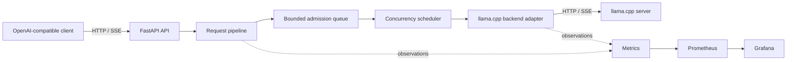

# llm-production-platform

`llm-production-platform` is a production-oriented educational project that
demonstrates how an LLM serving API can be designed around FastAPI and a
CPU-hosted [llama.cpp](https://github.com/ggerganov/llama.cpp) server.

The project focuses on the systems surrounding inference: API compatibility,
streaming, admission control, queueing, observability, deployment, and
repeatable performance measurement. It is deliberately small enough to study
and modify. It is not intended to compete with inference engines such as vLLM
or SGLang.

This repository is currently in the design phase. It contains documentation and
planning only; application code is intentionally deferred to the phased
development plan.

## Goals

- Expose a documented subset of the OpenAI REST API.
- Proxy inference to a separately running llama.cpp server.
- Stream responses without buffering the complete model output.
- Bound resource use with an explicit request queue and concurrency limit.
- Publish application and inference metrics for Prometheus.
- Provide a useful Grafana dashboard and a Docker Compose deployment.
- Make benchmarks reproducible on a CPU-only development machine.
- Keep API, orchestration, backend, telemetry, and deployment concerns separate.
- Provide stable extension points for authentication, rate limiting, multiple
  models, Kubernetes, and distributed operation.

## Non-goals

- Reimplementing model inference, tokenization, or continuous batching.
- Matching every OpenAI API endpoint or parameter in the first release.
- Outperforming specialized distributed serving engines.
- Treating in-process queueing as a distributed scheduler.
- Providing high availability or multi-node coordination in the initial
  deployment.
- Claiming benchmark results that generalize beyond the recorded hardware,
  model, quantization, and configuration.

## Initial API scope

The first compatibility target is:

- `GET /health/live`
- `GET /health/ready`
- `GET /v1/models`
- `POST /v1/chat/completions`, with both buffered and Server-Sent Events (SSE)
  responses
- `GET /metrics`

OpenAI compatibility is a versioned, tested contract rather than a claim that
all OpenAI behavior is supported. Unsupported fields and endpoints will be
documented, and compatibility fixtures will cover response envelopes, error
objects, and streaming termination.

## System at a glance



FastAPI owns the public protocol. The service layer owns request orchestration,
queueing, cancellation, and concurrency policy. A backend adapter translates
the internal request model to llama.cpp's API. Metrics observe these boundaries
without controlling them.

See [Architecture](docs/architecture.md) for component boundaries and the
complete request lifecycle.

## Planned repository layout

The layout below is a design target, not yet implemented:

```text
.
├── src/llm_platform/
│   ├── api/             # HTTP routes, schemas, error and SSE presentation
│   ├── application/     # use cases and request orchestration
│   ├── domain/          # internal models, policies, and ports
│   ├── backends/        # llama.cpp adapter and backend transport
│   ├── scheduling/      # queue and concurrency implementations
│   ├── observability/   # metrics, logging, and request context
│   └── config/          # typed settings and composition root
├── tests/
│   ├── unit/
│   ├── integration/
│   ├── contract/
│   └── load/
├── benchmarks/          # scenarios, runner configuration, and result schema
├── deploy/
│   ├── docker/
│   ├── prometheus/
│   └── grafana/
├── docs/
└── compose.yaml
```

Dependencies point inward: protocol and infrastructure code depend on
application/domain interfaces, not the reverse. Framework objects, llama.cpp
payloads, and Prometheus collectors do not leak into core orchestration.

## Delivery strategy

Implementation is divided into small vertical phases. Every phase ends with a
runnable system and automated acceptance checks; later phases add capability
without invalidating earlier behavior:

1. Walking skeleton and health endpoints
2. Non-streaming chat completion
3. End-to-end streaming
4. Bounded queue and concurrency control
5. Production error handling and lifecycle management
6. Metrics and structured logs
7. Prometheus, Grafana, and Docker Compose
8. Reproducible benchmarks and documentation hardening

The detailed entry criteria, deliverables, tests, and exit criteria are in the
[Development plan](docs/development-plan.md).

## Design principles

- **Bound every resource.** Queue size, active requests, timeouts, response
  sizes where practical, and metric label sets have explicit limits.
- **Propagate cancellation.** Client disconnects and shutdown signals cancel
  queued or active work and release capacity promptly.
- **Preserve backpressure.** Streaming data is forwarded incrementally through
  bounded buffers; a slow client must not create unbounded memory growth.
- **Measure state transitions.** Queue delay, backend latency, stream duration,
  outcomes, and current queue/active counts are observable.
- **Keep policy replaceable.** In-memory FIFO scheduling is the initial policy,
  behind interfaces that can later be replaced by per-tenant or distributed
  admission control.
- **Prefer explicit compatibility.** Supported API behavior is documented and
  contract-tested.
- **Make deployment reproducible.** Image digests or versions, model identity,
  configuration, and benchmark metadata are recorded.

## Documentation

- [Architecture](docs/architecture.md): boundaries, request lifecycle, failure
  behavior, configuration, and extension points
- [Development plan](docs/development-plan.md): independently testable delivery
  phases
- [Metrics](docs/metrics.md): metric contract, labels, dashboards, and alerts
- [Contributor/agent guidance](AGENTS.md): rules for future implementation work

## Current status

Design complete; implementation has not started.

