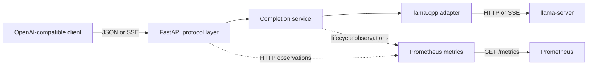
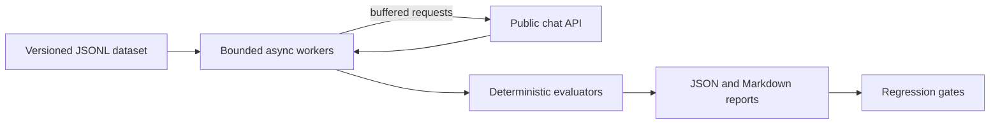
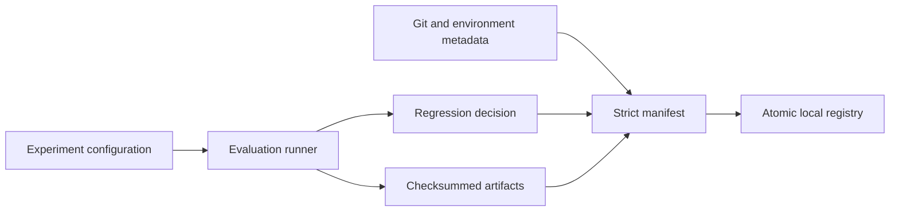
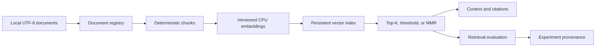

# LLM Production Platform

[](pyproject.toml)
[](docs/deployment.md)
[](.github/workflows/ci.yml)
[](tests)
[](LICENSE)
[](pyproject.toml)

A production-oriented, CPU-first LLM engineering platform built around
FastAPI and [llama.cpp](https://github.com/ggml-org/llama.cpp). It demonstrates
the systems surrounding inference—streaming, compatibility, observability,
evaluation, reproducibility, deployment, and retrieval—without reimplementing
the inference engine.

The repository is deliberately local, inspectable, and educational. Default
tests require no model, GPU, Docker daemon, hosted API, database, or secret.

## Project overview

The platform has four independently usable surfaces:

- an OpenAI-shaped FastAPI gateway for a separately running `llama-server`;
- `llm-eval`, a deterministic evaluation and regression CLI;
- `llm-experiment`, an immutable local experiment registry; and
- `llm-rag`, a deterministic local retrieval engineering toolkit.

The serving runtime does not import the evaluation, experiment, or RAG
packages. Each surface has explicit persistence, failure, privacy, and
reproducibility contracts.

## Why this project exists

Running a model is only one part of production LLM engineering. The surrounding
system must define what happens when streams fail, clients disconnect,
upstream data is malformed, experiments drift, artifacts change, or retrieval
results cannot be traced to source text.

This project makes those concerns visible in a compact codebase:

- protocol and backend wire formats stay separated;
- streaming preserves backpressure and cancellation;
- metrics use bounded-cardinality labels;
- evaluations and regressions are deterministic;
- experiment artifacts are immutable and checksummed;
- RAG inputs, chunks, indexes, contexts, and citations are fingerprinted; and
- deployment and tests remain reproducible on CPU-only machines.

It is a reference and portfolio project, not a replacement for vLLM, SGLang,
managed model platforms, distributed schedulers, or production vector
databases.

## Architecture

### Serving architecture



FastAPI owns public schemas, errors, and SSE presentation. The application
service owns completion lifecycle and terminal outcomes. The backend adapter
alone understands llama.cpp transport details. Observability is passive and
cannot replace an inference result.

### Evaluation pipeline



### Experiment pipeline



### Production RAG pipeline



See [docs/architecture.md](docs/architecture.md) for boundaries, lifecycle,
failure handling, and extension paths.

## Supported capabilities

### Serving API

| Endpoint | Behavior |
|---|---|
| `GET /health` and `/health/live` | Process-local liveness |
| `GET /ready` and `/health/ready` | Live llama-server readiness probe |
| `GET /v1/models` | Configured public model |
| `POST /v1/chat/completions` | Buffered or incremental SSE completions |
| `GET /metrics` | Process-local Prometheus exposition |

The supported chat request fields are `model`, `messages`, `temperature`,
`max_tokens`, and `stream`. Unknown fields are rejected rather than silently
ignored. Streaming success ends with exactly one `[DONE]`; failed or cancelled
streams do not emit it.

### Engineering tools

| Tool | Purpose |
|---|---|
| `llm-eval` | Versioned datasets, deterministic evaluators, reports, and regression gates |
| `llm-experiment` | Reproducible identities, immutable runs, aliases, comparisons, and integrity verification |
| `llm-rag` | Document registration, chunking, local embeddings, indexing, retrieval, citations, and retrieval metrics |

## Feature timeline

| Milestone | Delivered capability |
|---:|---|
| 0 | Installable FastAPI foundation and health endpoints |
| 1 | Buffered chat completions through a llama.cpp backend port |
| 2 | Incremental SSE streaming, cancellation, and bounded parsing |
| 3 | Prometheus metrics and correlated structured lifecycle logs |
| 4 | Deterministic evaluation and regression gates |
| 5 | Non-root Docker/Compose deployment and model-free CI |
| 6 | Reproducible local experiment registry |
| 7 | Production-oriented local RAG engineering |

The implementation through milestone 7 is the v1.0 feature set. Later roadmap
items are proposals, not partially implemented behavior.

## Project structure

```text
.
├── src/llm_platform/
│   ├── api/              # FastAPI routes, schemas, errors, SSE
│   ├── application/      # Completion orchestration
│   ├── domain/           # Backend-neutral models and ports
│   ├── backends/         # llama.cpp HTTP/SSE adapter
│   ├── config/           # Typed settings and composition
│   ├── observability/    # Prometheus adapter
│   ├── evaluation/       # Datasets, evaluators, reports, regression
│   ├── experiments/      # Identities, manifests, registry, comparison
│   └── rag/              # Documents, chunks, embeddings, retrieval
├── tests/                # Offline unit, contract, and integration tests
├── evaluations/          # Versioned datasets and local report locations
├── experiments/          # Local registry layout and prompt examples
├── deploy/               # Gateway image and Prometheus configuration
├── scripts/              # Container and registry smoke tests
├── docs/                 # Architecture and operational contracts
├── compose.yaml
└── compose.llama.yaml
```

## Quick start

Python 3.12 or newer is required. From a repository checkout:

```bash
python3 -m venv .venv
source .venv/bin/activate
python -m pip install --upgrade pip
python -m pip install -e '.[dev]'
```

Start the gateway. It can boot without a model server; liveness will be healthy
while readiness correctly reports unavailable:

```bash
uvicorn llm_platform.main:app --host 127.0.0.1 --port 8000
```

In another terminal:

```bash
curl --fail http://127.0.0.1:8000/health
curl --fail http://127.0.0.1:8000/metrics
curl --silent http://127.0.0.1:8000/ready
```

To serve completions, place a compatible GGUF model at
`./models/model.gguf`, start a compatible `llama-server`, then start the
gateway with the matching backend URL:

```bash
./llama-server \
  --model ./models/model.gguf \
  --host 127.0.0.1 \
  --port 8080
```

```bash
LLAMA_SERVER_BASE_URL=http://127.0.0.1:8080 \
LLM_PLATFORM_MODEL=local-model \
uvicorn llm_platform.main:app --host 127.0.0.1 --port 8000
```

Send a buffered request:

```bash
curl --fail http://127.0.0.1:8000/v1/chat/completions \
  -H 'content-type: application/json' \
  -d '{
    "model": "local-model",
    "messages": [{"role": "user", "content": "Explain backpressure briefly."}],
    "temperature": 0,
    "max_tokens": 80,
    "stream": false
  }'
```

Or stream incrementally:

```bash
curl --no-buffer --fail http://127.0.0.1:8000/v1/chat/completions \
  -H 'content-type: application/json' \
  -d '{
    "model": "local-model",
    "messages": [{"role": "user", "content": "Count to three."}],
    "temperature": 0,
    "max_tokens": 40,
    "stream": true
  }'
```

Configuration and error behavior are documented in
[docs/architecture.md](docs/architecture.md).

## Docker

Build and start the non-root gateway:

```bash
docker compose up --build gateway
```

The base deployment expects a separately managed llama-server at
`host.docker.internal:8080`. Start optional Prometheus on loopback:

```bash
docker compose --profile observability up --build gateway prometheus
```

To run the optional CPU llama-server service, first place a compatible model at
`./models/model.gguf`, then run:

```bash
LLAMA_MODEL_PATH=./models/model.gguf \
docker compose -f compose.yaml -f compose.llama.yaml \
  --profile inference up --build gateway llama-server
```

Run the deterministic model-free container acceptance test:

```bash
python3 scripts/container_smoke.py
```

The image runs as UID/GID `10001`, uses a read-only root filesystem, drops
capabilities, and never includes model weights. See
[docs/deployment.md](docs/deployment.md) for configuration, health, shutdown,
WSL2, and security details.

## Evaluation

With the gateway and backend ready, run the checked-in dataset:

```bash
llm-eval run \
  --dataset evaluations/datasets/serving-concepts.jsonl \
  --base-url http://127.0.0.1:8000 \
  --model local-model \
  --timeout 120 \
  --max-concurrency 1 \
  --output-dir evaluations/reports
```

Reports are written as JSON and Markdown. After reviewing the newest report,
promote it manually and run explicit gates; the tool never updates baselines
automatically:

```bash
CURRENT_REPORT="$(
  find evaluations/reports -maxdepth 1 -type f \
    -name 'evaluation-*.json' | sort | tail -n 1
)"
test -n "$CURRENT_REPORT"
cp "$CURRENT_REPORT" evaluations/baselines/serving-concepts.json

llm-eval compare \
  --current "$CURRENT_REPORT" \
  --baseline evaluations/baselines/serving-concepts.json \
  --min-pass-rate 0.80 \
  --max-pass-rate-drop 0.05 \
  --max-error-rate 0.05 \
  --max-p95-latency-seconds 5 \
  --max-p95-latency-increase-percent 20
```

The dataset schema, normalization, metrics, report privacy policy, and exit
codes are in [docs/evaluation.md](docs/evaluation.md).

## Experiment registry

Register an evaluation with source, environment, input, regression, and
artifact provenance:

```bash
llm-experiment run \
  --dataset evaluations/datasets/serving-concepts.jsonl \
  --base-url http://127.0.0.1:8000 \
  --model local-model \
  --registry-dir experiments \
  --max-concurrency 1 \
  --timeout-seconds 120
```

Inspect the local registry:

```bash
llm-experiment list --registry-dir experiments
llm-experiment alias --help
llm-experiment compare --help
llm-experiment verify --help
```

Runs are assembled in same-filesystem staging directories, finalized by atomic
rename, and never overwritten. Artifacts carry SHA-256 and byte-size metadata.
See [docs/reproducibility.md](docs/reproducibility.md) for identity,
comparison, privacy, and integrity semantics.

## Production RAG

The RAG workflow is fully local and does not require a running gateway. Register
a real repository document and build an index:

```bash
llm-rag ingest docs/rag.md \
  --store rag-data \
  --content-type text/markdown

llm-rag build-index \
  --store rag-data \
  --chunk-size 800 \
  --overlap 100 \
  --separator-strategy paragraph \
  --dimension 256
```

Retrieve cited context and inspect the store:

```bash
llm-rag retrieve "How is citation correctness measured?" \
  --store rag-data \
  --top-k 5

llm-rag inspect --store rag-data
```

Retrieval output includes stable document/chunk identities, scores, ranks,
character ranges, deterministic context, and structured citations. The local
hashing embedder is a reproducible lexical baseline and performs no download.

Evaluation datasets map queries to relevant chunk IDs. The evaluator reports
Precision@K, Recall@K, MRR, Hit Rate, citation correctness, and context
utilization:

```bash
llm-rag evaluate --help
```

See [docs/rag.md](docs/rag.md) for the dataset format, fingerprint rules,
index persistence, metrics, experiment integration, and limitations.

## CLI reference

All command groups provide built-in help:

```bash
llm-eval --help
llm-eval run --help
llm-eval compare --help

llm-experiment --help
llm-experiment run --help
llm-experiment list --help
llm-experiment show --help
llm-experiment compare --help
llm-experiment alias --help
llm-experiment verify --help

llm-rag --help
llm-rag ingest --help
llm-rag build-index --help
llm-rag retrieve --help
llm-rag evaluate --help
llm-rag inspect --help
llm-rag show-document --help
llm-rag show-chunk --help
```

## Development

Install the development extras:

```bash
python3 -m venv .venv
source .venv/bin/activate
python -m pip install --upgrade pip
python -m pip install -e '.[dev]'
```

Run the complete quality suite:

```bash
ruff format --check .
ruff check .
mypy
pytest
python -m pip check
git diff --check
```

The default suite is deterministic and offline. It uses fake or mock transports
and must not download a model. Real llama.cpp/model checks are explicit,
machine-local integrations.

Before changing behavior, read [AGENTS.md](AGENTS.md),
[docs/architecture.md](docs/architecture.md), and
[docs/development-plan.md](docs/development-plan.md). Contribution expectations
are in [CONTRIBUTING.md](CONTRIBUTING.md).

## Documentation

| Document | Contents |
|---|---|
| [Architecture](docs/architecture.md) | Boundaries, request lifecycle, failure model, configuration, extensions |
| [Evaluation](docs/evaluation.md) | Dataset schema, evaluators, reports, regression gates |
| [Metrics](docs/metrics.md) | Names, labels, timing boundaries, cardinality |
| [Deployment](docs/deployment.md) | Image, Compose, health, Prometheus, CI, security |
| [Reproducibility](docs/reproducibility.md) | Experiment identity, manifests, registry, integrity |
| [Production RAG](docs/rag.md) | Documents, chunks, embeddings, indexes, retrieval, citations |
| [Development plan](docs/development-plan.md) | Delivered milestones and deferred roadmap |
| [ADRs](docs/adr) | Accepted architectural decisions |

## Roadmap

The v1.0 feature set ends at milestone 7. The documented future sequence is:

1. bounded in-process queueing and concurrency control;
2. explicit resilience and process lifecycle management;
3. Grafana and operational deployment extensions;
4. reproducible benchmark tooling; and
5. release hardening and compatibility documentation.

Longer-term possibilities include authentication, per-principal rate limiting,
multi-model routing, Kubernetes packaging, and distributed admission. These
are intentionally absent today. See
[docs/development-plan.md](docs/development-plan.md) for entry and exit criteria.

## Limitations

- The gateway requires a separately supplied compatible llama.cpp server and
  GGUF model for inference.
- OpenAI compatibility is an explicit subset, not a claim of full API parity.
- The gateway is unauthenticated and binds to loopback by default.
- There is no runtime request queue, concurrency limiter, graceful drain state,
  rate limiting, multi-model routing, or distributed coordination.
- Metrics and active-request gauges are process-local.
- Evaluation is buffered and lexical; it does not provide semantic judging or
  time-to-first-token measurements.
- Experiment integrity detects changes but does not provide signatures,
  trusted timestamps, or remote attestation.
- The RAG hashing embedder is lexical, and its JSON index is intended for
  bounded local experiments rather than large-scale vector search.
- Default CI is model-free and does not establish model quality or performance.

## Future work

Future changes should preserve the established API, cancellation,
bounded-cardinality, offline-test, provenance, and privacy contracts. New
infrastructure should be introduced only with explicit public behavior,
failure semantics, migration guidance, and deterministic tests.

Phase 8 has not been started.

## Contributing

Issues and pull requests are welcome when they keep the project educational,
bounded, and locally reproducible. Please read
[CONTRIBUTING.md](CONTRIBUTING.md) and
[CODE_OF_CONDUCT.md](CODE_OF_CONDUCT.md) before participating.

For vulnerabilities, follow [SECURITY.md](SECURITY.md) rather than opening a
public issue.

## License

Released under the [MIT License](LICENSE).
