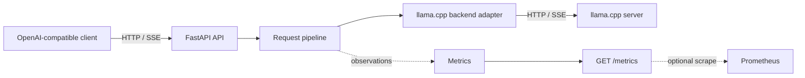

# llm-production-platform

`llm-production-platform` is a production-oriented educational project that
demonstrates how an LLM serving API can be designed around FastAPI and a
CPU-hosted [llama.cpp](https://github.com/ggerganov/llama.cpp) server.

The project focuses on the systems surrounding inference: API compatibility,
streaming, admission control, queueing, observability, deployment, and
repeatable performance measurement. It is deliberately small enough to study
and modify. It is not intended to compete with inference engines such as vLLM
or SGLang.

Phase 7 is implemented: the repository contains a locally runnable FastAPI
service with health checks, model discovery, and buffered or SSE-streaming chat
completions forwarded to a separately running llama.cpp server, plus
Prometheus-compatible production metrics and a separate deterministic
evaluation/regression CLI. It also provides a reproducible non-root gateway
image, Docker Compose deployment, Prometheus scraping, and deterministic CI.
It also provides a fully local reproducible experiment registry that binds
evaluation artifacts to code, data, configuration, environment, and regression
decisions.
It additionally provides a deterministic local RAG engineering CLI for
content-addressed documents, reproducible chunks and CPU embeddings, persistent
vector indexes, cited retrieval, retrieval evaluation, and experiment
provenance.
Later capabilities remain on the phased development plan.

## Goals

- Expose a documented subset of the OpenAI REST API.
- Proxy inference to a separately running llama.cpp server.
- Stream responses without buffering the complete model output.
- Bound resource use with an explicit request queue and concurrency limit.
- Publish application and inference metrics for Prometheus.
- Provide a useful Grafana dashboard and a Docker Compose deployment.
- Make benchmarks reproducible on a CPU-only development machine.
- Keep API, orchestration, backend, telemetry, and deployment concerns separate.
- Make local retrieval inputs, indexes, metrics, and provenance reproducible.
- Provide stable extension points for authentication, rate limiting, multiple
  models, Kubernetes, and distributed operation.

## Non-goals

- Reimplementing model inference, tokenization, or continuous batching.
- Matching every OpenAI API endpoint or parameter in the first release.
- Outperforming specialized distributed serving engines.
- Treating in-process queueing as a distributed scheduler.
- Providing high availability or multi-node coordination in the initial
  deployment.
- Claiming benchmark results that generalize beyond the recorded hardware,
  model, quantization, and configuration.

## Initial API scope

The first compatibility target is:

- `GET /health/live`
- `GET /health/ready`
- `GET /v1/models`
- `POST /v1/chat/completions`, with both buffered and Server-Sent Events (SSE)
  responses
- `GET /metrics`

The currently implemented Phase 3 subset is:

- `GET /health` and `GET /health/live` for process-local liveness;
- `GET /ready` and `GET /health/ready` for a live llama-server probe;
- `GET /v1/models` for the configured public model;
- `POST /v1/chat/completions` for buffered and SSE-streaming requests; and
- `GET /metrics` for bounded-cardinality Prometheus exposition.

OpenAI compatibility is a versioned, tested contract rather than a claim that
all OpenAI behavior is supported. Unsupported fields and endpoints will be
documented, and compatibility fixtures will cover response envelopes, error
objects, and streaming termination.

## System at a glance



FastAPI owns the public protocol. The service layer owns request orchestration,
cancellation, timing, and terminal outcomes. A backend adapter translates the
internal request model to llama.cpp's API. Metrics observe these boundaries
without controlling them. Queueing and concurrency policy remain planned
later-phase service responsibilities.

See [Architecture](docs/architecture.md) for component boundaries and the
complete request lifecycle.

## Planned repository layout

The layout below is a design target, not yet implemented:

```text
.
├── src/llm_platform/
│   ├── api/             # HTTP routes, schemas, error and SSE presentation
│   ├── application/     # use cases and request orchestration
│   ├── domain/          # internal models, policies, and ports
│   ├── backends/        # llama.cpp adapter and backend transport
│   ├── scheduling/      # queue and concurrency implementations
│   ├── observability/   # metrics, logging, and request context
│   ├── evaluation/      # standalone datasets, runner, reports, and gates
│   ├── experiments/     # local identities, manifests, registry, and CLI
│   ├── rag/             # local documents, chunks, indexes, retrieval, evaluation
│   └── config/          # typed settings and composition root
├── tests/
│   ├── unit/
│   ├── integration/
│   ├── contract/
│   └── load/
├── benchmarks/          # scenarios, runner configuration, and result schema
├── evaluations/         # versioned datasets, reviewed baselines, local reports
├── deploy/
│   ├── docker/
│   ├── prometheus/
│   └── grafana/
├── docs/
└── compose.yaml
```

Dependencies point inward: protocol and infrastructure code depend on
application/domain interfaces, not the reverse. Framework objects, llama.cpp
payloads, and Prometheus collectors do not leak into core orchestration.

## Delivery strategy

Implementation is divided into small vertical phases. Every phase ends with a
runnable system and automated acceptance checks; later phases add capability
without invalidating earlier behavior:

0. Walking skeleton and health endpoints
1. Non-streaming chat completion
2. End-to-end streaming
3. Production observability
4. LLM evaluation and regression
5. Reproducible containerized deployment and CI/CD
6. Reproducible LLM engineering
7. Production RAG engineering
8. Bounded queue and concurrency control
9. Production error handling and lifecycle management
10. Grafana and operational deployment extensions
11. Reproducible benchmarks
12. Release hardening

The detailed entry criteria, deliverables, tests, and exit criteria are in the
[Development plan](docs/development-plan.md).

## Design principles

- **Bound every resource.** Queue size, active requests, timeouts, response
  sizes where practical, and metric label sets have explicit limits.
- **Propagate cancellation.** Client disconnects and shutdown signals cancel
  queued or active work and release capacity promptly.
- **Preserve backpressure.** Streaming data is forwarded incrementally through
  bounded buffers; a slow client must not create unbounded memory growth.
- **Measure state transitions.** Queue delay, backend latency, stream duration,
  outcomes, and current queue/active counts are observable.
- **Keep policy replaceable.** In-memory FIFO scheduling is the initial policy,
  behind interfaces that can later be replaced by per-tenant or distributed
  admission control.
- **Prefer explicit compatibility.** Supported API behavior is documented and
  contract-tested.
- **Make deployment reproducible.** Image digests or versions, model identity,
  configuration, and benchmark metadata are recorded.

## Documentation

- [Architecture](docs/architecture.md): boundaries, request lifecycle, failure
  behavior, configuration, and extension points
- [Development plan](docs/development-plan.md): independently testable delivery
  phases
- [Metrics](docs/metrics.md): metric names, labels, lifecycle semantics, and
  cardinality policy
- [Evaluation](docs/evaluation.md): dataset, evaluator, report, and regression
  contracts
- [Deployment](docs/deployment.md): image, Compose, health, Prometheus, and CI
  behavior
- [Reproducibility](docs/reproducibility.md): experiment identity, manifests,
  registry, integrity, privacy, and comparison semantics
- [Production RAG](docs/rag.md): documents, chunking, embeddings, indexes,
  retrieval, citations, evaluation, and experiment provenance
- [Contributor/agent guidance](AGENTS.md): rules for future implementation work

## Local run

Python 3.12 or newer is required. On Ubuntu 24.04/WSL2, create an isolated
environment and install the application plus development checks:

```bash
python3 -m venv .venv
source .venv/bin/activate
python -m pip install --upgrade pip
python -m pip install -e '.[dev]'
```

Runtime dependencies are deliberately small: FastAPI provides the ASGI/API
layer, Pydantic validates public and upstream boundaries, httpx provides the
shared asynchronous backend client, prometheus-client owns the isolated
metrics registry and exposition format, and Uvicorn runs the ASGI process. The
optional `dev` group adds only pytest/pytest-asyncio for tests, Ruff for
formatting/linting, and mypy for static type checking. Version ranges constrain
each dependency to its current major release.

Start a compatible `llama-server` separately. The exact binary path, model,
context, and CPU thread count are local choices; a typical invocation is:

```bash
./llama-server \
  --model ./models/your-model.gguf \
  --host 127.0.0.1 \
  --port 8080
```

The model file must be supplied locally and must not be committed. Verify that
the selected llama.cpp build exposes `/health` and the OpenAI-compatible
`/v1/chat/completions` endpoint.

Then start the API:

```bash
LLAMA_SERVER_BASE_URL=http://127.0.0.1:8080 \
LLAMA_SERVER_TIMEOUT_SECONDS=120 \
LLM_PLATFORM_MODEL=local-model \
uvicorn llm_platform.main:app --host 127.0.0.1 --port 8000
```

`LLAMA_SERVER_BASE_URL` defaults to `http://127.0.0.1:8080`,
`LLAMA_SERVER_TIMEOUT_SECONDS` defaults to 120 seconds,
`LLAMA_SERVER_STREAM_IDLE_TIMEOUT_SECONDS` defaults to 30 seconds,
`LLAMA_SERVER_STREAM_EVENT_MAX_BYTES` defaults to 1 MiB, and
`LLM_PLATFORM_MODEL` defaults to `local-model`. Settings are validated at
startup. The buffered timeout continues to cover backend HTTP operations; the
stream idle timeout applies independently between upstream reads. Generation
requests are never retried automatically.

Check the service and send a completion:

```bash
curl http://127.0.0.1:8000/health
curl http://127.0.0.1:8000/ready
curl http://127.0.0.1:8000/v1/chat/completions \
  -H 'content-type: application/json' \
  -d '{
    "model": "local-model",
    "messages": [{"role": "user", "content": "Say hello briefly."}],
    "stream": false
  }'
```

Run all checks:

```bash
ruff format --check .
ruff check .
mypy
pytest
```

### Phase 1 real-backend smoke test

Phase 1 was verified end to end on WSL2 Ubuntu with an AMD Ryzen 7 5800H in
CPU-only mode. The backend was the llama.cpp `llama-server` binary at
`/home/chen1/projects/llm-inference-optimization-lab/third_party/llama.cpp/build-release/bin/llama-server`,
serving the Q4_K_M quantization of Qwen2.5-0.5B-Instruct from
`/home/chen1/projects/llm-inference-optimization-lab/models/qwen2.5-0.5b-instruct-q4_k_m.gguf`.

The verified request path was:

```text
curl client -> FastAPI -> llama.cpp llama-server
            -> Qwen2.5-0.5B-Instruct GGUF
            -> OpenAI-compatible JSON response
```

With `llama-server` at `http://127.0.0.1:8080` and the platform at
`http://127.0.0.1:8000`, `GET /health`, `GET /ready`, `GET /v1/models`, and
`POST /v1/chat/completions` all returned HTTP 200. The chat response retained
the backend's `id`, `object`, `model`, `choices`, `usage`,
`system_fingerprint`, and `timings` fields.

Reproduce the smoke test from the repository root in separate terminals:

```bash
/home/chen1/projects/llm-inference-optimization-lab/third_party/llama.cpp/build-release/bin/llama-server \
  --model /home/chen1/projects/llm-inference-optimization-lab/models/qwen2.5-0.5b-instruct-q4_k_m.gguf \
  --host 127.0.0.1 \
  --port 8080
```

```bash
LLAMA_SERVER_BASE_URL=http://127.0.0.1:8080 \
LLAMA_SERVER_TIMEOUT_SECONDS=120 \
LLM_PLATFORM_MODEL=local-model \
uvicorn llm_platform.main:app --host 127.0.0.1 --port 8000
```

```bash
curl --fail http://127.0.0.1:8000/health
curl --fail http://127.0.0.1:8000/ready
curl --fail http://127.0.0.1:8000/v1/models
curl --fail http://127.0.0.1:8000/v1/chat/completions \
  -H 'content-type: application/json' \
  -d '{
    "model": "local-model",
    "messages": [{"role": "user", "content": "Say hello briefly."}],
    "stream": false
  }'
```

This smoke test checks platform integration and response handling; the answer
quality of this small model is not a platform correctness signal.

### Supported chat completion fields

| Field | Phase 2 behavior |
|---|---|
| `model` | Required and forwarded |
| `messages` | Required; `system`, `user`, and `assistant` text messages |
| `temperature` | Optional and forwarded |
| `max_tokens` | Optional and forwarded |
| `stream` | Optional; `false` returns JSON and `true` returns SSE |
| Any other field | Rejected rather than silently ignored |

Successful responses are validated as OpenAI-shaped JSON and retain
llama.cpp extension fields. Safe, structured upstream 4xx details are retained;
upstream 5xx, invalid JSON/shape, timeouts, and connection failures are mapped
to stable gateway errors without exposing Python exception details or raw
backend bodies.

Phase 2 intentionally has no request queue, concurrency limit, authentication,
rate limiting, Prometheus/Grafana, Docker, or Kubernetes.

## Phase 2 Streaming

### Architecture

Streaming follows the existing ports-and-adapters boundaries:

```text
FastAPI route -> CompletionService -> InferenceBackend port
              -> LlamaCppBackend -> llama-server SSE
```

The llama.cpp adapter owns the upstream HTTP response and incrementally parses
bounded SSE events into backend-neutral chunks. The completion service owns
stream timing and terminal logging. The API layer serializes those chunks into
OpenAI-compatible SSE frames. Each layer awaits the next layer directly, so a
slow client applies backpressure without an unbounded queue or a background
producer task. Closing or cancelling the downstream iterator closes the
upstream response.

TTFT is measured from the start of the backend stream operation to the first
chunk containing non-empty assistant content. Every stream writes one terminal
structured log record containing `request_id`, `ttft_seconds` (or `null` when
no content arrived), `stream_duration_seconds`, and `outcome`.

### Supported API

`POST /v1/chat/completions` accepts the same supported fields for buffered and
streaming calls. With `"stream": true`, a successful response has
`Content-Type: text/event-stream`, emits each OpenAI
`chat.completion.chunk` as `data: {json}`, and terminates exactly once with:

```text
data: [DONE]

```

The response is not accumulated before delivery. Unicode and events split
across HTTP transport reads are supported. A malformed, truncated, timed-out,
or disconnected upstream stream emits a stable OpenAI-shaped SSE error frame
after headers have been sent, closes the response, and never emits `[DONE]`.
Backend HTTP or transport failures detected before streaming headers use the
normal OpenAI-shaped JSON error response.

### Streaming example

A successful response has this shape:

```text
data: {"id":"chatcmpl-1","object":"chat.completion.chunk","created":1700000000,"model":"local-model","choices":[{"index":0,"delta":{"role":"assistant"},"finish_reason":null}]}

data: {"id":"chatcmpl-1","object":"chat.completion.chunk","created":1700000000,"model":"local-model","choices":[{"index":0,"delta":{"content":"Hello"},"finish_reason":null}]}

data: [DONE]

```

Use `curl --no-buffer` to display events as they arrive:

```bash
curl --no-buffer http://127.0.0.1:8000/v1/chat/completions \
  -H 'content-type: application/json' \
  -d '{
    "model": "local-model",
    "messages": [{"role": "user", "content": "Count to three briefly."}],
    "stream": true
  }'
```

### Limitations

- Compatibility covers only the request fields listed above and OpenAI-style
  chat completion chunks; unsupported fields are rejected.
- There are no heartbeat events or automatic generation retries.
- The stream idle timeout is per upstream read, not a total generation
  deadline. The total stream duration can therefore exceed it while chunks
  continue to arrive.
- SSE events larger than `LLAMA_SERVER_STREAM_EVENT_MAX_BYTES` are rejected to
  keep parser memory bounded.
- Queueing, concurrency limits, authentication, rate limiting, dashboards,
  containers, and orchestration remain later phases.

## Phase 3 Observability

### Metrics architecture

Each FastAPI application instance creates one private Prometheus
`CollectorRegistry` during composition and exposes it through `GET /metrics`.
The application completion service reports backend-neutral lifecycle events
through a small metrics port; only the adapter under `observability` imports
prometheus-client. This keeps Prometheus collectors out of the domain and
backend adapters and makes every test application independent of
process-global collector state.

The completion service is the terminal lifecycle owner. It balances gauges in
cleanup paths, records one terminal chat outcome, and uses the same bounded
outcome vocabulary as structured stream logs. Metrics are passive
observations: collector failures are logged and do not replace an inference
result.

### Using `/metrics`

```bash
curl --fail http://127.0.0.1:8000/metrics
```

A minimal Prometheus configuration for a Prometheus process running on the same
host is:

```yaml
global:
  scrape_interval: 15s
  scrape_timeout: 10s

scrape_configs:
  - job_name: llm-platform
    static_configs:
      - targets: ["127.0.0.1:8000"]
```

The metrics endpoint does not count its own scrapes. No Prometheus server or
deployment files are included in this phase.

### Key metrics

| Metric | Type | Meaning |
|---|---|---|
| `llm_platform_http_requests_total` | Counter | Completed HTTP traffic by normalized endpoint, method, and status class |
| `llm_platform_chat_requests_total` | Counter | Exactly one terminal outcome per validated buffered or streaming chat request |
| `llm_platform_generated_tokens_total` | Counter | Trusted backend-reported completion tokens |
| `llm_platform_upstream_errors_total` | Counter | Upstream failures using a bounded error taxonomy |
| `llm_platform_client_disconnects_total` | Counter | Completion lifecycles cancelled by client disconnect |
| `llm_platform_request_duration_seconds` | Histogram | Validated request start through terminal cleanup |
| `llm_platform_time_to_first_token_seconds` | Histogram | Backend start to first non-empty content chunk |
| `llm_platform_upstream_duration_seconds` | Histogram | Backend start through upstream termination and cleanup |
| `llm_platform_active_requests` | Gauge | Currently active completion lifecycles by mode |
| `llm_platform_active_streams` | Gauge | Currently active streaming lifecycles |

The complete label, timing, terminal-outcome, and histogram contract is in
[Metrics](docs/metrics.md).

### Label-cardinality policy

Labels are fixed allowlisted values such as normalized endpoint, method,
status class, `buffered`/`streaming` mode, terminal outcome, and normalized
upstream error type. Request IDs remain available only in logs. Prompts,
generated content, client identity, exception messages, raw paths, backend
bodies, and model file paths are never metric labels.

### Current limitations

- Metrics are process-local. Multiple Uvicorn workers expose separate
  registries and do not aggregate each other.
- Token counts are emitted only when a validated backend response or stream
  chunk supplies a non-negative integer `usage.completion_tokens`.
- A client cancellation is classified as a disconnect in this phase because
  graceful shutdown cancellation is not implemented yet.
- Queue, concurrency, readiness, process-runtime, Grafana, alerting, and
  llama.cpp-native metrics remain outside this phase.

## Current status

Phase 7 production RAG engineering is implemented alongside the unchanged
Phase 1–6 runtime, evaluation, metrics, deployment, and experiment behavior.

## Phase 4 Evaluation and Regression

### Evaluation architecture

The `llm-eval` tool is a separate client of the running platform:

```text
versioned JSONL -> bounded async evaluation workers
                -> POST /v1/chat/completions (buffered)
                -> deterministic evaluators
                -> JSON + Markdown reports
                -> optional baseline regression gates
```

Nothing in the FastAPI application imports `llm_platform.evaluation`. The
evaluation runner uses a fixed number of workers, preserves dataset ordering,
does not retry generation, and continues after an individual request or
evaluator error.

### JSONL dataset format

Each non-empty line is one strict schema-version `1.0` case:

```json
{
  "schema_version": "1.0",
  "id": "kv-cache-purpose",
  "category": "serving_concepts",
  "messages": [{"role": "user", "content": "What does a KV cache store?"}],
  "expected": {
    "contains_all": ["key", "value"],
    "case_sensitive": false,
    "normalize_whitespace": true
  },
  "generation": {"temperature": 0.0, "max_tokens": 80},
  "metadata": {
    "description": "Checks the core KV-cache concept.",
    "tags": ["kv-cache"]
  }
}
```

IDs must be unique. Roles are limited to `system`, `user`, and `assistant`.
Unknown fields, empty message/evaluator lists, malformed JSON, invalid
generation limits, and invalid evaluator bounds are rejected. See
[Evaluation](docs/evaluation.md) for the complete schema.

### Deterministic evaluators

Every successful response receives a non-empty check. Cases can additionally
configure exact match, contains-all, contains-any, forbidden-string detection,
and response character-length bounds. Comparisons default to Unicode
case-insensitive matching with whitespace runs collapsed; either behavior can
be changed explicitly per case. There is no fuzzy matching or LLM-as-a-Judge.

### Run an evaluation

Install the project, start the platform separately, then run:

```bash
llm-eval run \
  --dataset evaluations/datasets/serving-concepts.jsonl \
  --base-url http://127.0.0.1:8000 \
  --model local-model \
  --timeout 120 \
  --max-concurrency 1 \
  --output-dir evaluations/reports
```

`LLM_PLATFORM_BASE_URL`, `LLM_PLATFORM_MODEL`,
`LLM_EVAL_TIMEOUT_SECONDS`, and `LLM_EVAL_MAX_CONCURRENCY` can supply defaults.
A run writes `evaluation-<run-id>.json` and `evaluation-<run-id>.md`. Exit `0`
means the run completed without request/evaluator errors; exit `3` means the
reports were written but one or more cases had an operational error. A
deterministic answer mismatch alone does not change the run exit code.

### Save and compare a baseline

Review a representative JSON report before promoting it:

```bash
cp evaluations/reports/evaluation-<reviewed-run-id>.json \
  evaluations/baselines/serving-concepts.json
```

Compare a current report with explicit gates:

```bash
llm-eval compare \
  --current evaluations/reports/evaluation-<current-run-id>.json \
  --baseline evaluations/baselines/serving-concepts.json \
  --min-pass-rate 0.80 \
  --max-pass-rate-drop 0.05 \
  --max-error-rate 0.05 \
  --max-p95-latency-seconds 5.0 \
  --max-p95-latency-increase-percent 20
```

Comparison exits `0` when every enabled gate passes and `1` when any gate
fails. Missing metrics fail gates that require them. Invalid input is exit `2`.

### Report examples

The JSON report contains schema/run identity, dataset SHA-256, platform
configuration, aggregate quality/latency/token metrics, bounded per-case
previews and evaluator results, safe errors, and Git metadata when available.
The Markdown companion summarizes the same run:

```text
Total cases: 5
Passed: 4
Errors: 0
Pass rate: 80.00%
P95 (nearest rank): 1.420000 seconds
```

Buffered evaluation records end-to-end latency but does not claim TTFT.

### CI usage

The evaluation framework itself is fully testable offline:

```bash
pytest \
  tests/test_evaluation_dataset.py \
  tests/test_evaluators.py \
  tests/test_evaluation_runner.py \
  tests/test_evaluation_reporting.py \
  tests/test_evaluation_regression.py \
  tests/test_evaluation_cli.py
```

A model-backed CI environment can run `llm-eval run`, retain both artifacts,
then invoke `llm-eval compare`; the compare exit code is the regression gate.
Default CI must use mock transports and must not download a model.

### Limitations

- Evaluation is buffered only, so TTFT and stream correctness are not measured.
- Evaluators are lexical and deterministic; they do not judge semantic
  equivalence.
- No external hosted LLM or LLM-as-a-Judge is used.
- There are no retries, warm-up scenarios, saturation workloads, or hardware
  telemetry in this phase.
- The example dataset demonstrates the schema; small local models are not
  expected to pass every case.

## Phase 5 Deployment and CI/CD

### Deployment architecture

The checked-in deployment is intentionally small:

```text
host client -> gateway:8000 -> external llama-server
                    |
                    +-> /metrics <- optional Prometheus:9090

optional overlay:
gateway -> CPU llama-server:8080 -> read-only host GGUF
```

The gateway image contains only the installed application and pinned runtime
dependencies. It runs one Uvicorn process as UID/GID `10001`, writes structured
logs to stdout/stderr, handles `SIGTERM`, and has a 15-second Compose stop grace
period. Queueing and concurrency limiting are not implemented in this phase.
See [Deployment](docs/deployment.md) for the complete operational contract.

Build the gateway image:

```bash
docker build -f deploy/docker/Dockerfile \
  -t llm-production-platform-gateway:phase5 .
```

Start only the gateway, forwarding requests to a llama-server on the host:

```bash
LLAMA_SERVER_BASE_URL=http://host.docker.internal:8080 \
docker compose up --build gateway
```

On Linux, Compose maps `host.docker.internal` through Docker's `host-gateway`.
On WSL2 with Docker Desktop integration, the same name reaches the host-side
service. Override `GATEWAY_PORT` when port 8000 is already in use.

### Optional local GGUF backend

The optional overlay uses a pinned CPU-compatible llama.cpp server image. It
never downloads a model and refuses to render without `LLAMA_MODEL_PATH`:

```bash
LLAMA_MODEL_PATH=./models/your-model.gguf \
docker compose -f compose.yaml -f compose.llama.yaml \
  --profile inference up --build gateway llama-server
```

`LLAMA_MODEL_PATH` may be an absolute Linux path or a repository-relative path.
From WSL2, prefer a path inside the Linux filesystem for predictable bind-mount
performance. The file is mounted at `/models/model.gguf` read-only. Optional
`LLAMA_THREADS` and `LLAMA_CONTEXT_SIZE` configure conservative CPU defaults;
`LLAMA_SERVER_IMAGE` can select another deliberately reviewed llama.cpp image.
No NVIDIA runtime, GPU, model download, or credential is used.

### Health, readiness, and Prometheus

`GET /health` and `GET /health/live` are process-local liveness endpoints.
Docker uses `/health`; therefore gateway-only development remains healthy when
the optional backend is absent. `GET /ready` and `GET /health/ready` probe the
configured llama-server and return HTTP 503 with
`{"status":"unavailable"}` until it can accept inference.

Start the gateway and the optional Prometheus profile:

```bash
docker compose --profile observability up --build gateway prometheus
```

Prometheus listens on `127.0.0.1:9090` by default and scrapes
`gateway:8000/metrics` every 15 seconds. It has no remote write or credentials.
All gateway metrics remain process-local.

Run the model-free container acceptance test:

```bash
python3 scripts/container_smoke.py
```

It builds and starts only the gateway, verifies liveness, Prometheus text,
documented unavailable readiness, and traceback-free responses, sends
`SIGTERM`, checks a clean exit, and removes its Compose resources.

### Configuration

Environment variables passed by the shell or a Compose `--env-file` override
the defaults in `compose.yaml`; Compose then passes resolved values to the
application, whose Pydantic settings validate them at startup. There is no
application `.env` loader. The supported gateway variables are:

- `LLAMA_SERVER_BASE_URL` (default in Compose:
  `http://host.docker.internal:8080`);
- `LLAMA_SERVER_TIMEOUT_SECONDS` (default `120`);
- `LLAMA_SERVER_STREAM_IDLE_TIMEOUT_SECONDS` (default `30`);
- `LLAMA_SERVER_STREAM_EVENT_MAX_BYTES` (default `1048576`); and
- `LLM_PLATFORM_MODEL` (default `local-model`).

No gateway value is secret today. Do not put credentials in a base URL,
Compose file, committed `.env`, image build argument, or log. The optional
backend requires `LLAMA_MODEL_PATH` only when its overlay is used.

### Evaluation against Compose

After readiness returns HTTP 200, run evaluation from the host:

```bash
llm-eval run \
  --dataset evaluations/datasets/serving-concepts.jsonl \
  --base-url http://127.0.0.1:8000 \
  --model local-model \
  --output-dir evaluations/reports
```

Review the generated report and compare it with an explicitly selected,
reviewed baseline using `llm-eval compare`. Deployment never updates baselines
and generated reports remain ignored unless intentionally curated.

### CI validation

Pull requests and pushes to `main` run two least-privilege jobs. The Python job
installs Python 3.12, exact runtime/development locks, and the editable project,
then checks Ruff formatting and lint, mypy, the complete pytest suite,
`pip check`, all three evaluation CLI help surfaces, and whitespace. The
container job renders the base Compose configuration, builds the gateway image,
and runs the model-free container smoke test. CI requires no GPU, GGUF model,
hosted API, running llama-server, secret, registry push, or cloud credential.

### Troubleshooting and limitations

- `/health` 200 with `/ready` 503 means the gateway is alive but the configured
  backend is absent or unhealthy. Check the backend URL and its `/health`.
- A missing-model interpolation error from the optional overlay means
  `LLAMA_MODEL_PATH` was not set to an existing host GGUF file.
- Bind or permission errors usually mean Docker cannot read the supplied model
  path. On Docker Desktop, ensure the location is shared with Docker.
- Prometheus is opt-in through the `observability` profile; gateway-only users
  do not need it.
- The deployment is unauthenticated, CPU-oriented, single-process, and has no
  request queue, concurrency limiter, Grafana, Kubernetes, distributed
  coordination, automatic model download, or image publishing pipeline.

## Phase 6 Reproducible LLM Engineering

### Architecture and identity

`llm-experiment` is a standalone local client layered on the existing
evaluation package:

```text
experiment configuration + versioned dataset
  -> canonical input fingerprint + source/environment capture
  -> existing EvaluationRunner and report rendering
  -> existing regression gates against an explicit baseline
  -> strict manifest + checksummed artifacts
  -> atomic local registry
```

The FastAPI application does not import `llm_platform.experiments`. A `run_id`
uniquely identifies one execution and includes a timestamp, short fingerprint,
and nonce. The 64-character `experiment_fingerprint` deterministically
identifies equivalent inputs and excludes timestamps, output metrics, run IDs,
and machine-specific paths. It includes dataset content, requested model,
generation defaults, evaluator/evaluation configuration, resolved baseline and
gates, optional prompt identity, and Git commit. The exact rules are documented
in [Reproducibility](docs/reproducibility.md).

### Manifest and registry

Every immutable `experiments/runs/<run-id>/manifest.json` records source commit,
dirty state and branch; dataset identifier/path/hash/case count; optional prompt
identity; requested and backend-observed model; generation, evaluation, and
regression configuration; regression decision; bounded environment and optional
deployment metadata; aggregate quality, latency, and token results; artifacts;
and a structured reproduction specification. Failed runs use a bounded safe
failure message.

Runs are assembled in a same-filesystem staging directory and finalized by
atomic rename. Existing run IDs are never overwritten. Artifact paths are
portable and relative, and `checksums.json` mirrors every stored artifact's
SHA-256 and byte size. Generated runs, aliases, and comparisons are ignored by
Git; curated examples and placeholders remain tracked.

### Run, inspect, and verify experiments

Start the gateway/backend separately, then run:

```bash
llm-experiment run \
  --dataset evaluations/datasets/serving-concepts.jsonl \
  --base-url http://127.0.0.1:8000 \
  --model local-model \
  --registry-dir experiments \
  --max-concurrency 2 \
  --timeout-seconds 120
```

List, inspect, and verify immutable artifacts:

```bash
llm-experiment list --registry-dir experiments
llm-experiment show <run-id-or-alias> --registry-dir experiments
llm-experiment verify <run-id-or-alias> --registry-dir experiments
```

Verification strictly parses the manifest and checksum index, rejects path and
symlink escapes, checks existence and byte size, and recalculates SHA-256.

### Baseline aliases and regression policy

Aliases are atomically updated mutable pointers without history. They can
reference only an existing immutable run:

```bash
llm-experiment alias set baseline <reviewed-run-id> \
  --registry-dir experiments
llm-experiment alias show baseline --registry-dir experiments
```

An experiment can explicitly use the reviewed baseline and existing Phase 4
gates:

```bash
llm-experiment run \
  --dataset evaluations/datasets/serving-concepts.jsonl \
  --base-url http://127.0.0.1:8000 \
  --model local-model \
  --registry-dir experiments \
  --baseline baseline \
  --min-pass-rate 0.80 \
  --max-error-rate 0.05
```

The manifest records both `baseline` and its resolved immutable run ID.
Experiments never create or update aliases automatically.

### Compare runs

Registered runs can be compared by ID or alias:

```bash
llm-experiment compare baseline candidate \
  --registry-dir experiments \
  --output-dir experiments/comparisons
```

JSON and Markdown classify input/configuration, source, environment, quality,
performance, and artifact changes. This is an audit view, not another gate;
only configured regression policy determines pass/fail.

### Reproduction, privacy, and limitations

`manifest.json` contains a bounded reproduction specification, and `summary.md`
renders a command using `${LLM_PLATFORM_BASE_URL}` instead of embedding a
service address or credential. It records the portable dataset path, requested
model, generation defaults, evaluation concurrency/timeout, resolved baseline,
gate values, source commit, and project version.

Environment capture is limited to Python version/implementation, OS/release,
architecture, project version, container detection, and allowlisted `httpx`
and `pydantic` versions. It never captures all packages or environment
variables, hostname, username, home directory, IP address, or secrets.
Manifests contain neither complete prompts nor generated responses. The
optional shared prompt stores only logical name, version, exact-byte hash, and
portable source path.

This provides configuration reproducibility, environment traceability,
deterministic report structure, and local artifact integrity. It does not
promise bit-for-bit generated text: model sampling, backend builds, CPU kernels,
and scheduling can still affect output. The registry has no signing, alias
history, database, remote replication, hosted UI, or schema migration utility.

Stable experiment CLI exits are `0` for success, `1` for regression failure,
`2` for invalid input, `3` for an operational evaluation failure with a
preserved manifest, `4` for registry/artifact integrity failure, and `5` for a
missing run or alias. Expected failures do not print tracebacks.

## Phase 7 Production RAG Engineering

### Architecture

`llm-rag` is a standalone, fully local engineering path:

```text
UTF-8 documents -> content-addressed registry -> deterministic chunks
               -> versioned CPU embeddings -> persistent JSON vector index
               -> top-K/threshold/MMR retrieval
               -> deterministic context + structured citations
               -> offline retrieval metrics + experiment provenance
```

The FastAPI application does not import `llm_platform.rag`; Phase 1–6 HTTP,
SSE, metrics, evaluation, deployment, and experiment CLI contracts are
unchanged. The local hashing embedder uses no hosted API or downloaded model,
and the JSON index is not an external vector database.

### Local workflow

Register a bounded UTF-8 source and build a reproducible index:

```bash
llm-rag ingest docs/rag.md \
  --store rag-data \
  --content-type text/markdown

llm-rag build-index \
  --store rag-data \
  --chunk-size 800 \
  --overlap 100 \
  --separator-strategy paragraph \
  --dimension 256
```

Retrieve ranked evidence with deterministic context and structured document,
chunk, character-range, and score citations:

```bash
llm-rag retrieve "How is citation correctness measured?" \
  --store rag-data \
  --top-k 5
```

Inspect the full provenance graph:

```bash
llm-rag inspect --store rag-data
llm-rag show-document <document-id> --store rag-data
llm-rag show-chunk <chunk-id> --store rag-data
```

### Retrieval evaluation and experiments

Strict local retrieval datasets map stable queries to relevant chunk IDs.
Evaluation reports Precision@K, Recall@K, MRR, Hit Rate, citation correctness,
context utilization, ordered case results, and context fingerprints:

```bash
llm-rag evaluate \
  --dataset retrieval-dataset.json \
  --store rag-data \
  --top-k 5 \
  --output retrieval-report.json \
  --experiment-metadata-output rag-metadata.json
```

Bind that metadata into an immutable Phase 6 experiment:

```bash
llm-experiment run \
  --dataset evaluations/datasets/serving-concepts.jsonl \
  --base-url http://127.0.0.1:8000 \
  --model local-model \
  --rag-metadata rag-metadata.json
```

The manifest records the corpus/document fingerprint, chunk configuration and
fingerprints, embedding configuration, index fingerprint, retriever
configuration, retrieval metrics, and citation metrics. RAG metadata affects
experiment identity when supplied; existing non-RAG experiment fingerprints
remain unchanged.

See [Production RAG](docs/rag.md) for lifecycle, metric, persistence, privacy,
and limitation details. Phase 7 does not add a RAG HTTP endpoint, answer
generation path, agent runtime, request scheduler, authentication, Kubernetes,
MLflow, Langfuse, hosted API, or external vector database.
