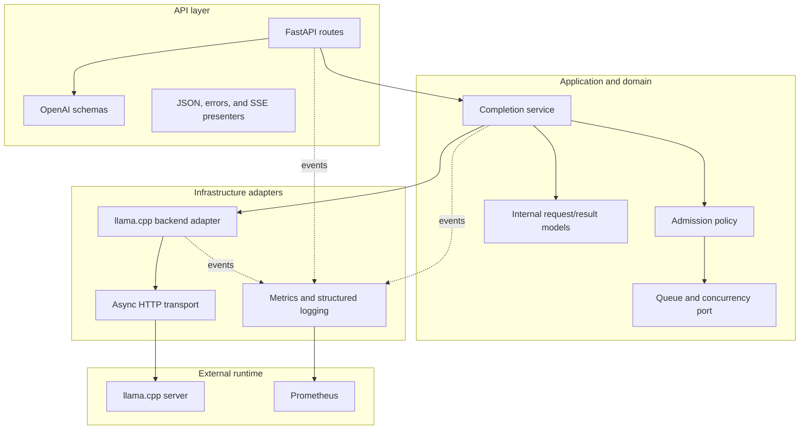
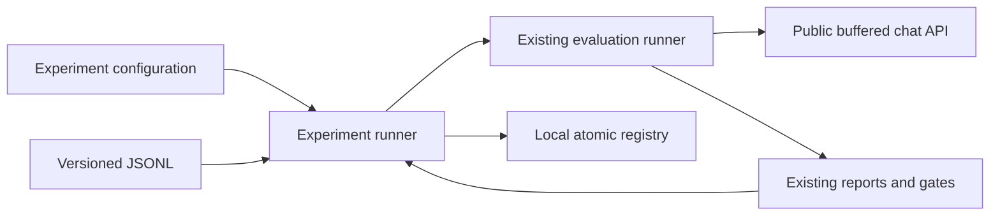
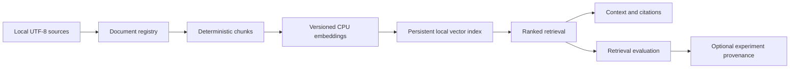
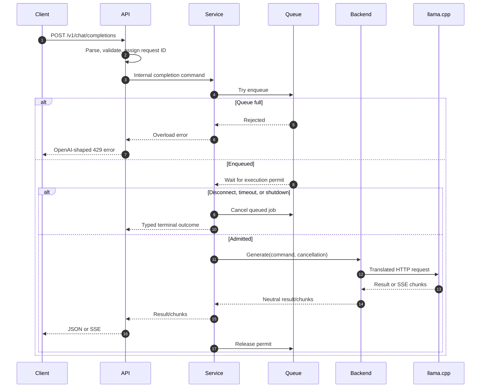

# Architecture

## 1. Purpose and constraints

The platform is an educational serving control plane around llama.cpp. It
provides a stable public API and production-oriented operational behavior while
delegating tokenization and inference to the llama.cpp server.

The initial environment is Ubuntu 24.04 under WSL2, Python 3.12+, an AMD Ryzen 7
5800H, and CPU-only inference. The design therefore favors a small number of
predictable concurrent generations over unbounded parallelism. All tuning
values remain configuration, because the correct values depend on the model,
context size, quantization, and llama.cpp thread settings.

## 2. Architectural style

The codebase follows ports-and-adapters boundaries with a thin API layer and an
application service that owns the request lifecycle.

The core defines ports for the backend, scheduler, clock, request identity, and
telemetry events. Concrete libraries are selected in the composition root at
process startup. The core never imports FastAPI, HTTP client response types,
Prometheus collectors, or llama.cpp-specific wire schemas.

This is pragmatic isolation, not abstraction for its own sake: ports exist at
boundaries that need contract tests, failure injection, or future replacement.

## 3. Runtime topology

The Phase 5 base Docker Compose deployment, unchanged by Phases 6 and 7,
contains:

1. **Gateway:** one Uvicorn/FastAPI process, the backend adapter, and
   `/metrics`.
2. **Prometheus:** an optional profile that scrapes the gateway.

By default the gateway reaches a separately managed host llama-server through
`host.docker.internal`. An optional Compose overlay adds a CPU llama-server on
the project network and requires one user-supplied GGUF file mounted read-only.
The model is never built into an image or downloaded automatically. Gateway
and Prometheus ports bind to host loopback. Grafana remains a later operational
extension.

The gateway is one process/worker, so metrics are process-local. There is no
request scheduler, queue, or concurrency limit in Phase 5; those remain future
application-layer work and are not implied by the container configuration.

Evaluation is not part of this runtime topology. The Phase 4 evaluation tool is
a separate command-line client that sends buffered requests through the public
OpenAI-compatible endpoint. The serving application does not import the
evaluation package, and evaluation failures cannot alter API process state.

Experiment tracking is also outside the runtime topology. The Phase 6
`llm_platform.experiments` package orchestrates the evaluation package, records
bounded source/environment metadata, and writes an atomic local registry. It is
an offline-capable CLI concern. Neither the serving application nor evaluation
logic imports it.

Production RAG is likewise outside the runtime topology. The Phase 7
`llm_platform.rag` package operates on bounded local documents and JSON
artifacts through `llm-rag`. It does not add a FastAPI route, dependency,
startup resource, model download, or Compose service. Its strict provenance
artifact can be supplied to the experiment layer, but the serving runtime
imports neither package.

## 4. Component responsibilities

### 4.1 API layer

The API layer owns HTTP behavior and nothing below it:

- route registration and OpenAPI documentation;
- parsing and structural validation of public request schemas;
- mapping public schemas to internal commands;
- request IDs and trace-context extraction;
- JSON and SSE response formatting;
- OpenAI-shaped error envelopes and HTTP status mapping;
- liveness, readiness, models, and metrics endpoints;
- client-disconnect detection at the protocol boundary.

It does not decide queue order, hold concurrency permits, build llama.cpp
payloads, or mutate Prometheus collectors directly.

Public schemas are separate from internal domain models. This prevents a change
in llama.cpp's API from changing the public contract and allows a future API
version to coexist with the current one.

### 4.2 Service layer

The completion service is the lifecycle owner. It:

- applies semantic validation and configured policy;
- checks whether the service is accepting new work;
- creates a request context with a stable request ID and cancellation scope;
- submits the job to the bounded scheduler;
- waits for admission while observing queue timeout and client cancellation;
- invokes the selected backend after a concurrency permit is granted;
- returns a buffered result or relays a stream incrementally;
- records lifecycle events and a terminal outcome exactly once;
- releases permits and resources in `finally`-equivalent cleanup paths.

Admission control and execution are distinct concepts. A queue slot bounds the
number of waiting jobs. An execution permit bounds calls actively consuming
backend capacity. In the initial FIFO implementation, a job enters a bounded
queue and the scheduler grants permits in order.

The service depends on interfaces:

- `InferenceBackend` for model discovery, readiness, buffered completion, and
  streaming completion;
- `RequestScheduler` for enqueue, admission, cancellation, and shutdown;
- `TelemetrySink` for lifecycle events;
- `Clock` and ID generation for deterministic tests.

Interface names are conceptual at this stage and may be refined during the
implementation phase.

### 4.3 Backend layer

The llama.cpp adapter is the only component that understands llama.cpp wire
formats. It:

- translates internal completion commands into supported llama.cpp requests;
- owns the reusable asynchronous HTTP client and connection pool;
- applies connect, response-header, idle-stream, and total timeouts as
  appropriate;
- maps backend response fields into backend-neutral chunks and results;
- parses upstream SSE incrementally;
- normalizes transport, protocol, timeout, and overload failures;
- exposes a readiness probe that represents actual backend usability;
- cancels or closes upstream requests when downstream work is cancelled.

The adapter must never silently ignore a public parameter. Each field is either
translated, handled by the service, or rejected as unsupported. A capability
table and contract tests will make this behavior explicit.

The adapter treats the upstream stream as untrusted input: malformed events,
unexpected content types, truncated streams, and non-success status codes
become typed backend errors.

### 4.4 Scheduling layer

The initial scheduler is bounded, in-memory, and FIFO:

- maximum waiting jobs is configurable;
- maximum active backend calls is configurable;
- queue wait has a configurable timeout;
- cancelled jobs are removed or skipped without consuming a permit;
- each admitted job releases exactly one permit;
- shutdown stops admission, drains for a bounded grace period, then cancels.

No specific numeric defaults should be presented as universally optimal. The
first implementation may use conservative defaults, but benchmark results on
the target CPU determine recommended settings.

Fairness beyond FIFO, priorities, per-tenant quotas, and distributed leases are
future policies behind the scheduler/admission interfaces.

### 4.5 Metrics layer

Observability is an adapter fed by lifecycle events. The application emits
events such as accepted, enqueued, admitted, backend-first-byte, completed,
cancelled, and failed. A Prometheus adapter converts those events into
counters, histograms, and gauges.

This keeps business flow testable without a Prometheus registry and prevents
metrics from becoming control flow. Structured logs use the same request
context and terminal outcome vocabulary. Metric names and label constraints are
specified in [Metrics](metrics.md).

### 4.6 Deployment layer

Deployment artifacts own:

- container build and non-root process configuration;
- liveness-based container health plus documented backend readiness;
- environment-driven settings and secrets injection points;
- basic resource-hardening and shutdown settings;
- optional read-only model mounts;
- Prometheus scrape configuration;
- version pinning and image/model provenance.

Deployment configuration does not contain application policy that cannot also
be set and validated by the application. Kubernetes is a future deployment
adapter, not a reason to embed Kubernetes concepts in the service layer.

### 4.7 Evaluation layer

The standalone `llm_platform.evaluation` package owns:

- strict versioned JSONL dataset parsing and content hashing;
- bounded asynchronous calls to the public buffered chat endpoint;
- deterministic answer evaluation and bounded response previews;
- reproducible JSON and Markdown report generation;
- baseline comparison and process exit codes for regression gates.

It depends on the public HTTP contract rather than application/domain
internals. The FastAPI application, completion service, domain, backend, and
observability packages have no dependency on evaluation code. This keeps
quality experiments and CI gating replaceable without creating a second
in-process serving path.

### 4.8 Experiment layer

The standalone `llm_platform.experiments` package owns:

- canonical input and environment SHA-256 identities;
- strict versioned experiment manifests;
- bounded Git and runtime metadata collection;
- orchestration of the existing evaluation/report/regression interfaces;
- immutable run directories finalized by atomic rename;
- checksum and byte-size verification with traversal/symlink defenses;
- mutable atomic aliases to existing immutable runs; and
- audit comparison of registered manifests and artifacts.

It does not own dataset parsing, evaluator behavior, public HTTP calls,
regression policy, FastAPI behavior, serving configuration, Prometheus
collectors, or deployment. The evaluation package remains independently usable
through `llm-eval`. The FastAPI composition root has no experiment dependency.

Run and environment fingerprints are content identities, not signatures.
Aliases are mutable pointers without history, while every experiment using one
records its resolved immutable baseline run ID. The complete schema, privacy,
and atomicity contract is in [Reproducibility](reproducibility.md) and the local
registry decision is in
[ADR 0003](adr/0003-local-reproducible-experiment-registry.md).

### 4.9 RAG layer

The standalone `llm_platform.rag` package owns:

- bounded immutable UTF-8 document registration and exact-byte identity;
- deterministic configuration-sensitive chunking and character offsets;
- a versioned local CPU embedding baseline with no model download;
- stable vector-index builds, persistent metadata, and integrity validation;
- top-K, threshold, and optional MMR retrieval with deterministic tie-breaking;
- ordered context assembly, token estimation, and structured citations;
- deterministic retrieval/citation/context metrics; and
- a portable provenance payload for the Phase 6 experiment manifest.

It does not own FastAPI routes, completion orchestration, llama.cpp transport,
Prometheus metrics, deployment, answer generation, or experiment-registry
atomicity. The FastAPI composition root has no RAG dependency. The Phase 6
experiment package accepts strict RAG metadata only when explicitly supplied;
non-RAG experiment identity and behavior remain unchanged.

The local JSON index is a bounded educational adapter. It intentionally trades
large-scale approximate-nearest-neighbor performance and concurrent mutation
for transparent stable ordering and inspectable reproducibility. The complete
contract is in [Production RAG](rag.md), and the roadmap insertion is recorded
in [ADR 0004](adr/0004-production-rag-before-runtime-scheduling.md).

## 5. Request lifecycle

### 5.1 Common lifecycle

Detailed state progression:

1. **Receive:** middleware accepts the request, validates or creates a request
   ID, and establishes request-scoped logging context.
2. **Validate:** the API validates shape; the service validates supported
   semantics and configured limits before queueing.
3. **Enqueue:** the scheduler atomically accepts the job or rejects it if the
   waiting bound is reached. Rejected work never reaches llama.cpp.
4. **Wait:** queue time is measured separately from inference time. Disconnect,
   queue timeout, and shutdown can cancel the job.
5. **Admit:** the scheduler grants a concurrency permit. Queue gauges change
   before the backend call begins.
6. **Execute:** the backend adapter translates and sends the upstream request.
7. **Deliver:** buffered responses are mapped once; streaming chunks are parsed,
   normalized, and forwarded with backpressure.
8. **Terminate:** exactly one outcome is recorded: success, validation error,
   queue full, queue timeout, backend error, timeout, client cancellation, or
   shutdown cancellation.
9. **Cleanup:** the upstream response, permit, queue bookkeeping, and request
   context are released even when cancellation occurs.

### 5.2 Non-streaming behavior

For `stream=false`, the backend result is accumulated by llama.cpp or the
adapter according to the upstream contract, translated to the supported OpenAI
response schema, and returned as one JSON document. The public response uses
the platform request/model identity and includes usage only when reliable usage
data is available.

The public request timeout includes queue wait plus backend processing unless
separate limits are explicitly documented. Internally, queue and backend
timeouts remain distinguishable for metrics and error diagnosis.

### 5.3 Streaming behavior

For `stream=true`, the API returns `text/event-stream`. Once admitted:

- the backend adapter reads llama.cpp events incrementally;
- each event is mapped to an internal chunk;
- the API presenter emits OpenAI-compatible `data: {json}\n\n` frames;
- the successful stream ends with `data: [DONE]\n\n`;
- bounded handoff and awaited writes preserve backpressure;
- periodic heartbeat comments may be added later only if documented and
  compatibility-tested.

Errors before response headers are sent use the normal OpenAI JSON error
envelope and status code. After streaming begins, the HTTP status cannot change.
The first implementation must define and contract-test a terminal SSE error
event, close the stream, and record the failure. It must never emit `[DONE]`
after a failed or cancelled generation.

If the client disconnects, cancellation propagates through the service to the
backend transport. The active permit is held until upstream work has actually
been cancelled/closed, preventing capacity from being reported as free too
early.

## 6. Error model

Internal exceptions are typed and mapped at the API edge. Expected categories
include:

| Category | Typical public status | Retry guidance |
|---|---:|---|
| Invalid request or unsupported parameter | 400/422 | Fix request |
| Unknown model | 404 | Select a listed model |
| Queue full | 429 | Retry with backoff |
| Queue wait timeout | 503 | Retry with backoff |
| Backend unavailable | 503 | Retry after readiness recovers |
| Backend timeout | 504 | Retry may duplicate work |
| Backend protocol error | 502 | Inspect backend/version |
| Internal failure | 500 | Inspect request ID and logs |

The status mapping is frozen by contract tests before public release.
Errors use an OpenAI-shaped envelope with stable `message`, `type`, `param`, and
`code` fields where applicable. Error messages must not expose stack traces,
internal URLs, secrets, or raw backend bodies.

Client cancellation commonly has no response because the connection is gone;
it is still a first-class internal outcome for cleanup and metrics.

## 7. Health and lifecycle

`/health/live` answers whether the API process/event loop is alive and does not
depend on llama.cpp.

`/health/ready` answers whether the instance should receive new inference work.
It is false while starting, shutting down, misconfigured, or unable to use the
configured backend. A short, bounded cache may prevent readiness probes from
overloading llama.cpp.

Startup:

1. Parse and validate settings.
2. Initialize telemetry and the shared HTTP transport.
3. Initialize the scheduler in non-accepting state.
4. Check backend/model compatibility.
5. Mark the scheduler accepting and readiness true.

Shutdown:

1. Set readiness false and stop accepting new work.
2. Reject new inference requests with a stable retryable error.
3. Cancel queued jobs or drain them according to the documented policy.
4. Allow active streams a configurable grace period.
5. Cancel remaining upstream work, release permits, and close transports.
6. Flush logs/telemetry where supported and stop the process.

## 8. Configuration

Settings are typed, validated at startup, and loaded from process environment
variables. Compose may interpolate a local environment or `--env-file`, but the
application does not load `.env` itself. Secrets are never committed or
emitted in logs.

Configuration groups:

- public bind address, port, advertised API/model identity;
- llama.cpp base URL and endpoint/capability selection;
- connect, queue, backend, idle-stream, and shutdown timeouts;
- maximum queued and active requests;
- accepted request limits such as message count and generation tokens;
- logging level/format and request-ID header;
- metrics enablement and histogram buckets;
- model path, context, threads, and llama.cpp flags in deployment configuration.

The running process should expose safe build/config metadata through logs and
metrics, but never high-cardinality or sensitive values.

## 9. Testing strategy by boundary

- **Domain/unit tests:** policy, state transitions, cancellation races, error
  mapping, and deterministic timing with fake clocks/backends.
- **API tests:** schema validation, error envelope, content types, headers, SSE
  frame sequence, and disconnect behavior using an in-process ASGI client.
- **Backend contract tests:** translation and parsing against a controllable fake
  HTTP server, including malformed/truncated SSE and delayed responses.
- **Scheduler tests:** capacity bounds, FIFO order, queue timeout, cancellation,
  permit leaks, and shutdown under concurrency.
- **Integration tests:** FastAPI to a small fake backend on every change; optional
  real llama.cpp/model tests behind an explicit marker.
- **Deployment smoke tests:** model-free Compose liveness, unavailable
  readiness, metrics exposition, traceback-free client responses, and clean
  termination; real-model buffered/streaming checks remain explicit and
  optional.
- **Load tests:** fixed scenarios with machine/model/config metadata and
  correctness assertions in addition to latency/throughput.
- **Evaluation tests:** strict dataset fixtures, deterministic lexical
  evaluators, mock HTTP transports, bounded worker synchronization, report
  fields, and regression gates.
- **Experiment tests:** canonical identity, strict manifests, environment
  allowlists, concurrent atomic registration, alias resolution, artifact
  integrity, orchestration reuse, registered-run comparison, CLI exits, and an
  offline registry smoke test.
- **RAG tests:** document/chunk identities, deterministic CPU embeddings,
  stable index rebuilds, ranked retrieval/MMR, context/citations, every
  retrieval metric, experiment provenance, and CLI contracts.

Tests must not require downloading a large model in the default suite.

## 10. Extension paths

### Authentication

Add an API dependency/middleware that produces a principal. Pass only a neutral
principal/tenant context into application policy. Keep credential parsing and
secret storage at the edge.

### Rate limiting

Insert a rate-limit policy before the expensive scheduler queue. It can use the
principal and request cost estimate. Expose a separate rejection category and
metrics; do not overload the concurrency semaphore to represent rate limits.

### Multiple models

Introduce a model registry and backend router implementing `InferenceBackend`.
Requests resolve public model IDs to configured backend targets before
admission. Scheduling may become per-model because capacity is a backend/model
property. Public schemas and the completion service remain stable.

### Kubernetes

Map liveness/readiness endpoints to probes, configuration to ConfigMaps/Secrets,
and the API/llama.cpp processes to workloads. Shutdown and resource requests
already have explicit semantics. A single-replica in-memory scheduler remains
valid; replicas require the distributed path below.

### Distributed deployment

Replace process-local admission with a distributed coordinator or route each
model/backend shard through a queue-owning gateway. Distributed leases need
fencing, expiry, idempotency considerations, and new failure semantics.
Interfaces permit this evolution, but the initial design makes no distributed
fairness or exactly-once guarantees.

## 11. Architectural decisions and trade-offs

Initial architectural decision records should capture:

1. FastAPI as the public protocol layer.
2. llama.cpp server over HTTP rather than in-process Python bindings, providing
   process isolation and independent backend tuning.
3. A single API worker with an in-memory bounded FIFO scheduler for clear,
   teachable semantics.
4. SSE for OpenAI-compatible streaming.
5. Lifecycle-event-driven Prometheus instrumentation with bounded labels.
6. A fake backend as the default integration-test dependency.
7. A standalone public-HTTP evaluation client rather than evaluation logic in
   the serving runtime.
8. A local filesystem experiment registry before an external tracking platform
   or database.
9. A standalone local RAG engineering layer before any serving-runtime RAG
   endpoint or external vector database.

These choices optimize clarity and replaceability. They explicitly trade away
multi-worker global admission and distributed scheduling until a later phase.
