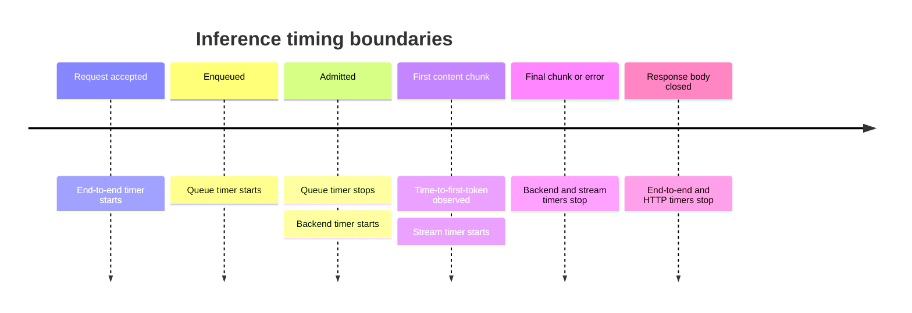

# Metrics

## 1. Objectives

Metrics must answer four operational questions:

1. Is the public API available and is the backend ready?
2. How much work is waiting and executing?
3. Where is request time spent?
4. Why are requests failing or being rejected?

Metrics complement structured logs. They do not contain prompts, generated
content, request IDs, user IDs, API keys, arbitrary URLs, or exception messages.

The examples below reserve the `llm_platform_` namespace. Names may be refined
once against the chosen Python Prometheus client, but once released they form a
compatibility contract and require a documented migration to change.

## 2. Label policy

Allowed labels use bounded enumerations:

- `endpoint`: normalized route group such as `chat_completions`, `models`, or
  `health`, never the raw URL;
- `method`: bounded HTTP method;
- `stream`: `true` or `false`;
- `outcome`: the terminal taxonomy defined below;
- `status_class`: `2xx`, `4xx`, or `5xx`, rather than every arbitrary value when
  class-level detail is sufficient;
- `model`: a configured public model identifier from a bounded registry;
- `backend`: a configured backend identifier from a bounded registry;
- `version`: build version on one info metric only.

Initial single-model metrics may omit `model` and `backend` where those labels
add no diagnostic value. This avoids unnecessary series and simplifies future
migrations.

Forbidden labels include request ID, client IP, prompt/content, error message,
exception class from arbitrary code, queue position, token text, and raw model
path. Authentication identities and rate-limit keys remain forbidden when
those features are added.

Label values are mapped to an allowlist. Unknown internal values become
`unknown`; they are not passed through directly.

## 3. Terminal outcome taxonomy

Every accepted HTTP inference request records exactly one terminal outcome:

- `success`
- `validation_error`
- `unsupported`
- `model_not_found`
- `queue_full`
- `queue_timeout`
- `backend_unavailable`
- `backend_timeout`
- `backend_error`
- `internal_error`
- `client_cancelled`
- `shutdown_cancelled`

HTTP middleware may separately count requests that fail before reaching the
completion service. The instrumentation design must prevent double-counting
between middleware and service metrics.

## 4. Metric contract

### 4.1 Service and HTTP metrics

| Metric | Type | Labels | Meaning |
|---|---|---|---|
| `llm_platform_build_info` | Gauge fixed at 1 | `version` | Build identity |
| `llm_platform_ready` | Gauge | none | `1` when accepting inference work and backend is usable |
| `llm_platform_http_requests_total` | Counter | `endpoint`, `method`, `status_class` | Completed HTTP requests |
| `llm_platform_http_request_duration_seconds` | Histogram | `endpoint`, `method` | Header-to-terminal HTTP duration |
| `llm_platform_inference_requests_total` | Counter | `stream`, `outcome` | Terminal inference requests |
| `llm_platform_inference_end_to_end_duration_seconds` | Histogram | `stream`, `outcome` | Accepted request to completion/cancellation |

Whether a streaming HTTP request is considered complete at header emission or
stream termination is often ambiguous in generic middleware. This project
defines completion as termination of the response body and tests that behavior.

### 4.2 Queue and scheduler metrics

| Metric | Type | Labels | Meaning |
|---|---|---|---|
| `llm_platform_queue_depth` | Gauge | none initially | Jobs currently waiting for admission |
| `llm_platform_active_requests` | Gauge | `stream` if reliable | Jobs holding an execution permit |
| `llm_platform_queue_capacity` | Gauge | none | Configured maximum waiting jobs |
| `llm_platform_concurrency_limit` | Gauge | none | Configured active request limit |
| `llm_platform_queue_wait_duration_seconds` | Histogram | `outcome` | Enqueue to admission or terminal queue exit |
| `llm_platform_admission_rejections_total` | Counter | `reason` | Rejections by bounded reason: `queue_full`, `not_ready`, `shutting_down` |

Queue and active gauges are updated at the state transition, not reconstructed
from request counters. Tests assert that both return to zero after every
scenario.

### 4.3 Backend and streaming metrics

| Metric | Type | Labels | Meaning |
|---|---|---|---|
| `llm_platform_backend_requests_total` | Counter | `stream`, `outcome` | Calls that actually reached the backend adapter |
| `llm_platform_backend_request_duration_seconds` | Histogram | `stream`, `outcome` | Backend call start to terminal backend event |
| `llm_platform_time_to_first_token_seconds` | Histogram | none initially | Admission/backend start to first content chunk; boundary is documented in implementation |
| `llm_platform_stream_duration_seconds` | Histogram | `outcome` | First emitted chunk to stream termination |
| `llm_platform_backend_in_flight` | Gauge | none initially | Open upstream inference calls |
| `llm_platform_input_tokens_total` | Counter | none initially | Input tokens reported by a trusted backend response |
| `llm_platform_output_tokens_total` | Counter | none initially | Generated tokens reported by a trusted backend response |
| `llm_platform_token_usage_missing_total` | Counter | `kind` | Responses missing reliable `input` or `output` usage |

Token counters are emitted only when llama.cpp provides semantics that are
validated for the supported endpoint/version. The platform must not estimate
tokens using a different tokenizer merely to populate a metric.

Time to first token must have one precise clock boundary. The recommended
primary definition is backend call start to receipt of the first content-bearing
chunk, separating queue wait from backend responsiveness. End-user time to first
token can be derived or exposed separately later as enqueue/receive to first
response-body chunk.

### 4.4 Process/runtime metrics

The Prometheus Python client may expose standard process and Python runtime
metrics such as CPU seconds, resident memory, garbage collection, and open file
descriptors. These keep their library-provided names. Event-loop lag and HTTP
connection pool metrics can be added only when their implementation and label
cost are understood.

llama.cpp's own metrics, if enabled by a compatible server version, are scraped
as a separate Prometheus target and are not renamed by the API. The Grafana
dashboard visually distinguishes API-derived values from backend-native values.

## 5. Timing boundaries

For buffered requests there may be no meaningful first-token observation at the
API boundary, so that histogram is streaming-only unless the backend exposes a
reliable first-token event.

Cancelled and failed operations are included in duration histograms with a
bounded `outcome` label where this is operationally useful. Dashboards filter
success when presenting latency service objectives.

## 6. Histogram buckets

Buckets are configuration chosen for CPU inference, where useful latencies may
range from milliseconds for queue rejection to minutes for generation.

Recommended principles:

- HTTP/queue buckets include fine resolution below one second.
- backend/end-to-end buckets extend through the configured request timeout.
- time-to-first-token buckets emphasize roughly 100 ms to tens of seconds.
- buckets are explicit and stable within a benchmark series.
- the highest finite bucket covers the normal timeout; `+Inf` must not be the
  only bucket receiving ordinary successful observations.

Exact defaults are selected with early target-hardware measurements in Phase 5,
then documented in configuration. Changing buckets resets histogram
comparability and should be treated like a metrics schema change.

## 7. Prometheus scrape design

Prometheus scrapes the API `/metrics` endpoint over the private deployment
network. Initial guidance:

- use a scrape interval short enough to observe queue/active gauges during CPU
  generations, without making the demo noisy;
- set a scrape timeout below the interval;
- give the API and llama.cpp separate jobs;
- do not place credentials in scrape labels;
- retain enough data for the intended benchmark window;
- pin Prometheus configuration in version control.

The metrics endpoint itself must not enter the inference queue. Its health and
latency are observable through Prometheus's target metrics and need not create a
self-referential high-volume application series.

## 8. Grafana dashboard

The provisioned dashboard should have these rows:

### Overview

- API readiness and Prometheus target health
- request rate
- success, rejection, and error rate
- p50/p95/p99 end-to-end latency for successful requests
- active requests and queue depth against configured limits

### Latency breakdown

- queue wait percentiles
- backend duration percentiles
- streaming time-to-first-token percentiles
- stream duration percentiles
- end-to-end latency split by `stream`

### Capacity and overload

- active requests versus concurrency limit
- queue depth versus queue capacity
- admission rejection rate by reason
- queue timeout rate
- client cancellation rate

### Backend

- backend in-flight calls
- backend request rate and failures by outcome
- backend duration
- token throughput derived with `rate()` only when reliable token counters exist
- llama.cpp-native CPU/inference metrics when available

### Runtime

- API process CPU and resident memory
- process restarts/uptime
- Python garbage collection/runtime metrics
- optional llama.cpp process resource metrics from an appropriate exporter

Dashboard variables may include a fixed interval and configured model/backend
only when their cardinality is bounded. A request-ID variable is prohibited.

## 9. Initial alerts and recording rules

Alerts are educational defaults and require tuning for the model and hardware:

- API target down or readiness zero for a sustained period;
- sustained non-zero queue near capacity;
- admission rejection or queue timeout rate above a configured threshold;
- backend error/timeout ratio above a configured threshold;
- successful p95 time to first token or end-to-end latency above a benchmarked
  threshold;
- repeated process restarts;
- active/queue gauges stuck above zero without matching request activity.

Use minimum traffic guards for ratio alerts to avoid noise at low volume.
Percentile recording rules should aggregate only across compatible histogram
buckets and retain necessary labels such as `stream`, while dropping
unnecessary dimensions.

No latency service-level objective is declared until a reference model,
quantization, prompt/output size, concurrency, and target hardware are fixed.

## 10. Metrics correctness tests

Instrumentation tests use an isolated registry and compare metric deltas, not
global process totals. Required cases:

- buffered and streaming success;
- validation failure before backend invocation;
- queue full and queue timeout;
- backend timeout/protocol error;
- disconnect while queued and while streaming;
- graceful and forced shutdown;
- malformed/missing usage data;
- concurrent requests and repeated scrape during state transitions.

Invariants:

- each inference request has exactly one terminal outcome;
- backend request count never includes queue rejections;
- queue and active gauges never go negative;
- all gauges return to baseline after cleanup;
- time-to-first-token is observed at most once per streaming request;
- successful `[DONE]` emission agrees with a success outcome;
- metric collection failures cannot change the API result.

